# Hibiscus AVG Engine V6.0

Hibiscus，意为木槿，朱槿


## 图例

正文、**重点**、~~已经移除~~

## 通用

### 扩展名

为`AvgSCript`的缩写`.asc`

### 加密

引擎使用Windows`CNG`(`Cryptography Next Generation`)API中`AES`算法进行加密，若要读取加密的文件，则需要在读取文件时指定十六位的解密Key

可使用`Utilities\Encrypter`下附带的工具对源文件进行加密/解密操作

在主程序根目录下放置文件名为`NOENCRYPT`的文件可禁用加密，用于调试

### 编码格式

脚本文件编码为`UTF-8`(支持`BOM`)或`ANSI`，需要根据具体格式对应设定主解析器

### 多语言

#### 通用

在设置中指定当前`LocalCode`以及`LocalCodeID`

引擎对`LocalCode`并没有实质上的要求，只要满足一一对应的关系即可，但是建议使用约定俗成的代号，请尽量不要做"用`ZH`指代日本，拿`CN`指代美国"这种给自己和别人找别扭的事

在`Settings.ini`中设定当前`LocalCode`

```INI
[Display]
;------------语言设定------------
Language=EN
```

在`Localization.dat`中设定`LocalCodeID`与`LocalCode`显示名称。同时，本地化字符串也在该文件中定义

```INI
[Definition]
; 在这里定义LocalCode ID，引擎根据该ID显示对应的本地化UI
Language_ZH = 0
Language_EN = 1
Language_JP = 2
Language_FR = 3
Language_RU = 4

; 在这里定义LocalCode显示名称，可通过替换表达式获取
LanguageDisplayName_ZH = 中文
LanguageDisplayName_EN = English
LanguageDisplayName_JP = 日本語
LanguageDisplayName_FR = français
LanguageDisplayName_RU = русский язык
```

#### UI

引擎根据`LocalCodeID`显示对应的本地化UI，最多支持`16`种不同语言UI

通常而言，默认朝向`0`为常规UI，朝向`16`为禁用状态(如中断存档)、选中状态(如快进按钮)或不同模式(如存档/读档页面的标题)，`LocalCodeID`实质为朝向的偏移量，实际显示的朝向为状态朝向+`LocalCodeID`

以上方的配置文件为例，若当前`LocalCode`为`EN`，则`LocalCodeID`为`1`，禁用按钮，更新至朝向`16`，实际朝向为`16 + 1 = 17`

#### 演出脚本

在脚本中，以`Lang[LocalCode]`为开头的行会被视为多语言行，与当前语言设定不同的行会视为注释，请在注释匹配表达式中添加`|Lang\[(?!Language_LocalCode).*\].*`

演出脚本支持的语言数量没有上限

指令解析阶段该前缀会被去除，保证对解析模块的透明性。若不需要多语言支持，可移除该前缀。该机制下，不同语言下指令的数量和参数允许不同，因此默认不允许读取切换语言后的存档。若保证指令数量和行为一致，可在脚本设置中启用`LangSwitchAble`参数

一个典型的多语言脚本如下所示

```AVGScript
Lang[ZH]姓名:对白
Lang[EN]Name:Dialogue

Lang[ZH]旁白
Lang[EN]Narrator

Lang[ZH]#SV=1:我爱你
Lang[EN]#SV=1:I LOVE YOU
```

若当前语言设定为`ZH`，引擎获取的脚本为

```AVGScript
Lang[ZH]姓名:对白

Lang[ZH]旁白

Lang[ZH]#SV=1:我爱你
```

引擎实际执行的脚本为

```AVGScript
姓名:对白

旁白

#SV=1:我爱你
```

### 坐标系统

#### AVG坐标系

| 类别 | 位置         |
| ---- | ------------ |
| 原点 | 画面底部中央 |
| 热点 | 对象底部中央 |

#### 真实坐标系

| 类别 | 位置                   |
| ---- | ---------------------- |
| 原点 | 当前窗口显示内容左上角 |
| 热点 | 图像对象:对象中心      |
|      | 字符串对象:对象左上角  |
|      | 其他对象:对象左上角    |

#### 坐标映射

引擎会自动进行AVG坐标至真实坐标的映射

读取存档时，若对象坐标映射关系复杂，会启用真实坐标模式，目前该模式为内部模式，无法通过指令开启

#### 布局参数

可在`Settings`中指定对象的位置，布局参数使用真实坐标系

默认的布局参数如下

```INI
[Layout]
; 布局参数为真实坐标

;------------姓名&对白------------
; 姓名文本
Name_X=165
Name_Y=495
; 姓名栏
NameBack_X=285
NameBack_Y=535

; 对白文本
Dialogue_X=250
Dialogue_Y=550
; 对话框
DialogueBack_X=640
DialogueBack_Y=600
; 文本状态
DialogueState_X=845
DialogueState_Y=85

; VN对白文本
VNDialogue_X=340
VNDialogue_Y=100
; VN对话框
VNDialogueBack_X=165
VNDialogueBack_Y=495
; VN文本状态
VNDialogueState_X=600
VNDialogueState_Y=520

;------------状态指示------------
; 回想模式
Recall_X=40
Recall_Y=30
; 自动模式
Auto_X=1240
Auto_Y=30
; 快进模式
FastFF_X=1240
FastFF_Y=30

;------------历史记录------------
; 偏移量
History_Offset=147

; 起始坐标
; 头像
History_Avatar_X=70
History_Avatar_Y=440
; 姓名
History_Name_X=85
History_Name_Y_Normal=520
History_Name_Y_NoHead=490
; 文本
History_Dialogue_X=330
History_Dialogue_Y=460
; 重听语音
History_Audio_X=35
History_Audio_Y=480
```

### 换行

在脚本内输入回车，系统会将回车前后的脚本视作两行。**仅有换行符的行不占用行数**

### 缩进

默认使用空字符(`\s`)进行代码缩进，任何指令行开始与结尾的缩进符号会被忽略

示例文本

```AVGScript
(不含引号)
" Test "
```

解析结果

```AVGScript
(不含引号)
"Test"
```

### 注释

#### 单行注释

一行内`;`、`(`、`//`之后的内容会被视为注释行，在解析时会被跳过。

#### 跳转标签

以`;`为开头，且位于注释区块外的行，会被系统作为跳转标签处理，在`JMP`等指令中使用

```AVGScript
;这是一行被系统作为跳转标签处理的注释
(这里开始转变为阴雨天气)
```

#### 注释区块

以`/*`开始，以`*/`结束的区块会被视为注释区块，不支持注释嵌套

### 指令

以`#`、`@`为前缀的行会被视为指令行，指令及其参数不区分大小写

指令的具体效果与使用方法请参见相关章节

### 颜色

除依次输入RGB参数指定颜色外，引擎还支持于RGB参数中R参数位置直接指定十六进制颜色\(即`#FFFFFF`或`0xFFFFFF`，引擎通过检测该行是否匹配十六进制正则表达式`(#|0[x|X])[0-9a-fA-F]{6}`以判断是否进入十六进制模式\)。

使用十六进制颜色的场合，`G`与`B`参数将会被忽略。

### 文本

#### 基本

非注释区块内，无`;`、`(`、`//`、`#`、`@`前缀的行会被视为文本，非`$`开头且具有姓名部分的行会被视为对白，其余情况视为旁白

| 旁白前缀 | 姓名   | 头像提示     | 英文冒号 | 桥接符   | 文本       |
| -------- | ------ | ------------ | -------- | -------- | ---------- |
| `($)`    | `Name` | `[HeadHint]` | `:`      | `(&/&&)` | `Dialogue` |

#### 旁白前缀

存在该前缀，且存在姓名部分时，该行按照旁白处理

#### 姓名

说话人的姓名，默认作为语音提示以查找音量定义。在头像提示不存在或头像提示指定的文件不存在时，姓名也用作替代头像提示

支持格式控制

#### 头像提示

姓名末尾的`[FileName]`会被视为头像提示，优先按照其指定的文件名在`Data\Graphics\Characters\Heads`下查找，若文件不存在，则使用姓名作为替代文件名查找。若姓名对应的文件名也不存在，则显示对应文件夹下的`Unknown.png`作为替代

#### 桥接符

在非VN模式下可以使用桥接符号`&`对旁白文本进行桥接，以实现在文本显示途中追加演出，可配合`#AutoChangePage`等指令实现自动翻页演出

```AVGScript
对话中间插入演出。
......
&这是不换行的演出。
......
&&这是换行的演出。
```

```AVGScript
对话中间插入演出。这是不换行的演出。
这是换行的演出。
```

#### 文本

可使用`/n`或`\n`作为换行的转义字符

支持格式控制

#### 格式控制

##### 通用

###### 转义

`/[`会被转义为`]`

###### 忽略

`[^]`后的所有格式控制都会被忽略

###### 忽略非图标

`[^-]`后除`[ICon]`外的所有格式控制，包括`[IConOffsetX]`等图标格式控制都会被忽略

###### 取消忽略

`[!^]`取消忽略所有格式

###### 重置

`[!]`重置格式到默认状态(即对象属性定义)

##### 图标

##### 插入图标

`[ICon = Direction, Frame]`

在文本中插入图标。若参数不足，则从右至左引用，即有一个参数时认为其是`Frame`

如果链接的是其他对象，则需要手动处理每个参数，并返回引用Key和对应的Surface指针

例:将文件路径的哈希值作为Key并返回库中的指针

`这里是头像[ICon = heads\<PF1>]`

##### 图标格式

###### 图标偏移

`[IConOffsetX = 0.0][/IConOffsetX]`&`[IConOffsetY = 0.0][/IConOffsetY]`

相对于当前字符大小百分比的偏移量，用于对齐图标与文本

参数为时`!`重置至默认值，参数以`+/-`开头则增/减至当前值

###### 图标比例

`[IConScale = 1.0][/IConScale]`

图标缩放比例

参数为时`!`重置至默认值，参数以`+/-`开头则增/减至当前值

###### 图标重采样

`[IConResample = 1][/IConResample]`

缩放时是否对原始图像进行重采样，1 = 启用，0 = 禁用

参数为时`!`重置至默认值

##### 震动

`[Shake = Type, Amplitude, TimerCoef, CharOffset]`

控制文本震动。若参数不足，则从左至右引用，即有一个参数时认为其是`Type`，两个参数时认为其是`Type`与`Amplitude`

`Type`: 震动类型，默认为`None`，可为`X`，`Y`，`Random`，其中`X`、`Y`基于三角函数
`Amplitude`: 震动幅度，默认为`1.0`，相对于震动文本的大小。如文本高度为`30`，`Amplitude = 0.5`，则震动幅度为`15`，会在`+/- 15`范围内震动
`TimerCoef`: 时间参数，默认为`1.0`，决定震动的速度
`CharOffset`: 字符偏移，默认为`1.0 / 6.0`，决定相邻字符的运动间隔，数值越大，运动间隔越大。该指仅在`X`、`Y`模式下有效，为相对于`360°`的系数。即`CharOffset = 0.2`，间隔为`72°`

##### 颜色

`[Color = #FFFFFFFF][/Color]` or `[C = #FFFFFFFF][/C]`

颜色参数为十六进制，顺序为`AARRGGBB`，或`A, R, G, B`

当RGB参数少于四个时，按照如下顺序引用:

```C++
// R
// R G
// R G B
// A R G B
```

参数为时`!`重置至默认值，参数以`+/-`开头则增/减至当前值

##### 字体

更新`LogFont`并创建绘制字体指针

###### 字体

`[Font = FontName][/Font]` or `[F = FontName][/F]`

参数为时`!`重置至默认值

###### 字号

`[Size = FontSize][/Size]` or `[S = FontSize][/S]`

参数为时`!`重置至默认值，参数以`+/-`开头则增/减至当前值

###### 加粗

`[Bold][/Bold]` or `[B][/B]`

###### 取消加粗

`[!Bold][/!Bold]` or `[!B][/!B]`

###### 倾斜

`[Italic][/Italic]` or `[I][/I]`

###### 取消倾斜

`[!Italic][/!Italic]` or `[!I][/!I]`

###### 下划线

`[Underline][/Underline]` or `[U][/U]`

###### 取消下划线

`[!Underline][/!Underline]` or `[!U][/!U]`

###### 删除线

`[StrikeOut][/StrikeOut]` or `[S][/S]`

###### 取消删除线

`[!StrikeOut][/!StrikeOut]` or `[!S][/!S]`

### 历史记录

历史记录头像位于`Data\Graphic\Characters\Heads`路径下，通过姓名匹配对应的`.PNG`文件
姓名后`[]`为头像提示，可通过替换表达式`<PF+ID>`替换为立绘文件名，如`<PF5>`代表`5`号立绘的立绘文件名，用于绑定

### 语音

#### 基本

引擎默认启用自动语音序列，即根据音频指针`NowTalking`值自动播放对应章节的语音文件。音频指针从零开始，根据对白进度自动更新，请在使用跳转指令后重新指定指针位置。

若设置项中启用了`SeparateDubID`，则不同角色的音频指针相互独立，且对应的语音文件名会增加语音提示作为前缀，如`丽丽娅_15`

#### 语音提示

姓名部分会被视为语音提示，引擎会根据剩余部分查找设置中的音量定义，来实现不同角色的不同音量。若该行的姓名部分以`$`开头，该行作为旁白处理。

`$<%DOL>Name:Dialogue`的语音提示为`<%DOL>Name`，经转义后为`$Name`，引擎会查找`Settings.ini`中`Audio`一节的`dub_$Name`项的值，作为播放该行语音时的音量

#### 处理流程

1. 若启动了自动语音序列，则更新`语音文件名`为`DubSequePrefix_NowTalking`
2. 根据语音提示更新音量
3. 计算路径`%AppPath% + data\Audio\dubs\Language_LocalCode\DubChapter\语音文件名`
4. 根据路径，寻找合法文件
5. 若文件不合法，则使用语言Fallback再次寻找，即根据路径`%AppPath% + data\Audio\dubs\Language_LocalCodeFallback\DubChapter\语音文件名`再次查找
6. 若仍不合法或音量为零，则终止播放

其中`Language_LocalCode`和`Language_LocalCodeFallback`为设置中指定的语言ID，`DubChapter`默认为当前章节名，即`dialogue\chapterFileName`。若`DubSequePrefix`为空，则`语音文件名`为`NowTalking`，无下划线

#### 调试信息

左上角会显示当前语音前缀，语音章节，语音文件名与播放文件名

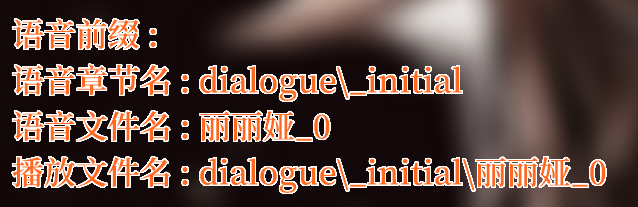

### 正则替换

在指令中可使用`<VValueID>`替换变量，使用`<SValueID>`替换字符串，其中`ValueID`为需要替换的变量ID

可在事件`RE_Extension`中对替换规则进行扩展，如将`<Gold>`替换为当前持有的金币数等。若替换后的字符串需要包含特殊字符，则需要使用替换功能进行转义。例如，若替换的文本中含有默认的分隔符`:`，需要将其转义为`<%COL>`，并在显示前对显示文本进行还原。还原时，会按照下表依次顺序进行替换。

显示文本，字符串，字符串变量支持该替换规则，具体转义规则请见下表

| 字符 | 转义     |
| ---- | -------- |
| `=`  | `<%EQS>` |
| `:`  | `<%COL>` |
| `\|` | `<%VBR>` |
| `<`  | `<%LAB>` |
| `>`  | `<%RAB>` |
| `&`  | `<%AND>` |
| `$`  | `<%DOL>` |
| `/`  | `<%SLH>` |
| `(`  | `<%LBR>` |
| `)`  | `<%RBR>` |

范例代码如下

```AVGScript
@Char=遥_兴奋_3.png:10:0:400

#SV=1:15
#SV=1:米奈尔

@Talking
// <>捕获的是最后一条指定了ID的指令的ID，也就是@Char=遥_兴奋_3.png:10:0:400中的10
我把最后<>点行李搬到<S1>家的时候，天已经黑了很久。/n其实东西并不多，但是我总能在每次到这边之后都再想起来<V1>件应该带来的物品。

我只剩下￥<Gold>这点钱了

现在是游戏时间<Calender_Year>年<Calender_Month>月<Calender_Date>日，现实时间<CurrentTime>，你已经玩了这个游戏<PlayTime>

#SV=2:这是一句带冒号<%COL>的数字123混合文本

冒号“<%COL>”可使用替换表达式<%LAB>%COL<%RAB>进行转义，例如<S2>
```

替换结果

```AVGScript
我把最后10点行李搬到米奈尔家的时候，天已经黑了很久。
其实东西并不多，但是我总能在每次到这边之后都再想起来15件应该带来的物品。

我只剩下￥5000这点钱了

现在是游戏时间216年12月13日，现实时间2021-9-30 23:16:18，你已经玩了这个游戏00:00:22

冒号“:”可使用<%COL>进行转义，例如“这是一句带冒号:的数字123混合文本”
```

替换优先级

非转义表达式在脚本更新阶段进行替换
`<>`>`<VID>`>`<SID>`

上述表达式匹配结束后开始循环匹配匹配`(<)([^%<>]+?)(>)`的自定义替换，直到没有匹配

自定义匹配定义于扩展`RE_Extension`中

转义优先级最低，仅在文本换行解析时进行替换
`<%EQS>`>`<%COL>`>`<%VBR>`>`<%LAB>`>`<%RAB>`

所有替换表达式请见下表

| 表达式             | 替换               |
| ------------------ | ------------------ |
| `<>`               | 捕获ID             |
| `<VID>`            | ID对应的数值变量   |
| `<SID>`            | ID对应的字符串变量 |
| `(<)([^%<>]+?)(>)` | 自定义匹配         |
| `<%EQS>`           | `=`                |
| `<%COL>`           | `:`                |
| `<%VBR>`           | `\|`               |
| `<%LAB>`           | `<`                |
| `<%RAB>`           | `>`                |
| `<%AND>`           | `&`                |
| `<%DOL>`           | `$`                |
| `<%SLH>`           | `/`                |
| `<%LBR>`           | `(`                |
| `<%RBR>`           | `)`                |

### 特殊符号

- 所有符号均为英文半角符号
- 历史记录中，旁白的姓名会被统一替换为`$`，请勿使用`$`作为角色的姓名

### 初始化

非读档时，引擎会自动进入初始化阶段，初始化阶段解析的指令会无叠化立即执行

在读取到文本或等待指令后，引擎自动退出初始化阶段

### 缓存

**注意:**缓存行为控制并未实现，默认行为为首次读取时缓存，并由用户手动释放，即`Load On Call`&`Erase At End`

在退出游戏前，所有使用到的图像素材均会被缓存，供下次使用时快速读取。默认行为为`Load On Call`&`Erase At End`，全部行为见下表：

| 名称            | 行为                                               |
| --------------- | -------------------------------------------------- |
| `Load On Call`  | 在第一次使用时读取并缓存                           |
| `Load At Start` | 在读取脚本时即读取该场景中使用的所有图像素材并缓存 |
| `Load All`      | 加载图像文件夹中的所有图像素材并缓存               |

| 名称           | 行为                     |
| -------------- | ------------------------ |
| `Erase At End` | 在退出后结束后清除缓存   |
| `Erase At EOF` | 在脚本执行结束后清除缓存 |

可在设置中指定默认行为：

```INI
[Cache]
; 在这里定义缓存读取行为
; 0 = Load On Call
; 1 = Load At Start
; 2 = Load All
CacheLoad = 0

; 在这里定义缓存清除行为
; 0 = Erase At End
; 1 = Erase At EOF
CacheErase = 0
```

若在脚本设置中指定了缓存行为，脚本设置会覆盖程序设置。如`#Settings=LoadAtStart|EraseAtEOF`会强制在读取脚本时加载所有图像素材，并在脚本执行结束后清除缓存

引擎会自动保存所有图像的引用计数，在清理时优先清理引用计数最少的图像
可在设置中指定保存列表，清除缓存时，位于该列表中的文件不会被清除，通常将其指定为特殊图像(如UI/FX)，请不要滥用，以避免出现频繁重载以及超出内存限制

```INI
[KeepList]

KeepItem_1 = dialog1.png
KeepItem_2 = dialog2.png
KeepItem_3 = dialog3.png
KeepItem_4 = dianull.png
KeepItem_5 = nameback1.png
KeepItem_6 = nameback2.png
KeepItem_7 = nameback3.png
KeepItem_8 = nameback4.png
KeepItem_9 = namenull.png
KeepItem_10 = VNModeBG.png
KeepItem_11 = VNModeNull.png
```

在退出(退出程序/当前脚本执行完成)时，引擎会自动保存具有最高权值的缓存对象，将其保存至缓存列表中。再次运行时，在完成脚本设置中的缓存任务后，引擎会开始缓存位于保存列表和缓存列表中的文件
缓存列表由程序自动生成，保存于`Settings`中，每次重新生成时旧有的内容都会被删除

```INI
[CacheList]

dialog2.png = 2_15
BG_A_City.png = 2_4
NULL.png = 2_3
dianull.png = 2_2
namenull.png = 2_1
```

所有缓存的对象均以`BitMap`的形式保存在内存中，在使用时转换为`Texture`并拷贝至显存中，请注意内存/显存占用

### 脚本设置

在脚本的第一行可以使用`#Settings`指令对脚本进行设置，格式如下

`#Settings=Param1|Param2|...`

其中不同参数使用`|`进行分割。

引擎支持下列参数

- `LangSwitchAble`
  - 该脚本支持切换语言后读取

- `VNMode` / `VN`
  - 启用Visual Novel模式
- `LiteMode` / `Lite`
  - 启用Lite模式，该模式下部分功能会被禁用

- `UnSkipAble`
  - 该脚本无法使用跳过按钮/快捷键跳过
  - 若需要中途启用，可使用`#SkipAble`指令

- `NoHistory`
  - 禁用历史记录功能
- `NoHistoryJump`
  - 禁用历史记录跳转功能
- `ResetHistory`
  - 开始对话时重置历史记录

- `SeparateDubID`
  - 对不同角色使用不同的语音ID

- 缓存控制
  - `LoadOnCall`
    - 在第一次使用时读取并缓存
  - `LoadAtStart`
    - 在读取脚本时即读取该场景中使用的所有图像素材并缓存
  - `LoadAll`
    - 加载图像文件夹中的所有图像素材并缓存
  - `EraseAtEnd`
    - 在退出后结束后清除缓存
  - `EraseAtEOF`
    - 在脚本执行结束后清除缓存

#### Lite模式

##### 说明

若需要在其他系统中反复调用引擎(如在大地图下与NPC反复对话)，则需要启用Lite模式。在Lite模式下，部分功能会被禁用，且部分行为会发生变化:

- 禁用功能
  - 天气控制
  - 保存与读取

- 行为变化
  - 标准模式下，在解析到第一行文本或等待指令前为初始化阶段(参见初始化一节)，Lite模式下没有初始化阶段，所有元素都将叠化显示
  - 默认显示一张半透明的黑色CG作为底板
  - 解析到`#EOF`指令时，不会报错，而是会调用叠化指令并进入跳转等待。等待结束后，会移除创建的对象(如对话文本)，恢复到调用前的状态

#### VN模式

##### 说明

引擎支持类似*ToHeart*、*FSN*的VN(Visual Novel)模式。启用后会禁用姓名栏和对话框的切换，普通模式下的对白文本控制指令也适用于VN模式。

当解析到对白时，VN模式会忽略姓名，并自动在对白文本前后添加`『`与`』`用于区分。

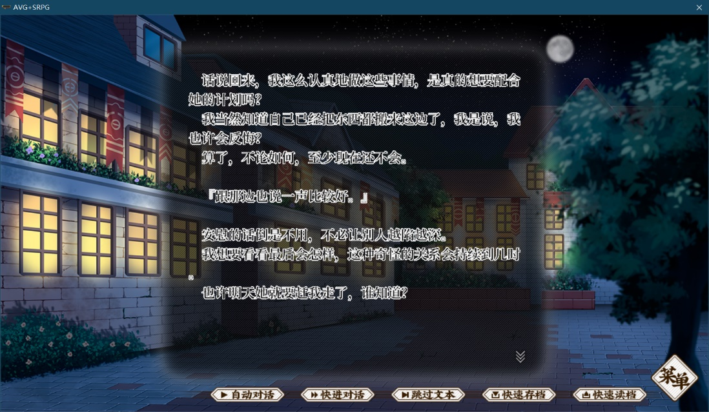

#### 控制指令

##### `#VNMode_Newline`

在文本间插入一个空行。建议在对白文本前后使用，以示区分。

##### `#VNMode_ChangePage`

切换页面。

由于VN模式允许一个页面内显示多句文本，因此程序无法自动处理，需要手动指定翻页点。不进行翻页会导致文本显示出界。

### 基本机制

#### 处理阶段

引擎主要存在三个处理阶段：

- 指令解析阶段
- 演出执行阶段
- 等待操作阶段

#### 指令解析阶段

**指令解析阶段**引擎进行脚本解析，执行对应指令的功能。若当前处于非快进/非初始化等非无叠化状态，且当前指令支持叠化，则更新对应对象的叠化指令，并在**演出执行阶段**执行叠化，否则指令直接生效。

在解析到等待指令或文本后，引擎进入**演出执行阶段↙**

#### 演出执行阶段

**演出执行阶段**引擎进行**指令解析阶段**指定的叠化操作，并检测叠化状态。

在叠化完成后：

若该阶段由等待指令触发，则在等待对应时间后，引擎返回**指令解析阶段↖**

若该阶段由文本触发，则引擎进入**等待操作阶段↙**

#### 等待操作阶段

**等待操作阶段**更新文本进度记录，进行文本的显示，并等待玩家操作。

若设定为快进模式，文本会立即显示完全，引擎会立即返回**指令解析阶段↖**

若设定为自动模式，在文本显示完全后

- 根据当前文本有语音，且语音播放结束后，引擎会返回**指令解析阶段↖**
- 根据当前文本无语音，且等待相应时间后，引擎会返回**指令解析阶段↖**

#### 详细信息

有关阶段的详细信息，请参见附录对应章节

### 调试

#### 说明

##### 设置项

若在`Settings\Settings.ini`中启用了全局Debug模式，即`[Debug]`组`Debug`项为`1`，则AVG系统的调试模式会自动启用

```ini
[Debug]
;------------调试模式------------
; 在这里定义是否显示调试参数
debug = 1

; Invalid File Alert
Debug_IFA = 0

; 调试模式直接打开存档页面
Debug_GotoSL = 1

; 快进到StopFF
Debug_GotoStopFF = 1

; 在这里定义调试重定向章节
Debug_AVG = Dialogue\_initial.asc
```

##### AVG调试模式

- 调试模式的开启与关闭会被存档存档保存
- 存档不会保存输出的调试信息

##### 调试信息

在调试模式下使用`Shift+C`组合键可将参数信息、层级信息和调试输出复制至剪贴板，如下所示：

```C++
参数信息
========================
扫描指针 : 37 || 状态阶段 : 3
文本指针 : 1 || 启用快进 : 0
履历指针 : 1 || 启用自动 : 0

层级信息
========================
当前立绘层共有 1 个层级
└─ 图像对象 : "ID = 1 " 位于层级 1

调试输出
========================
└─ @Char=Char.png:1
└─ @NameTrans
└─ @DiaTrans
  └─ @CharChange=..UIdialog3.png:-2
```

##### 截图

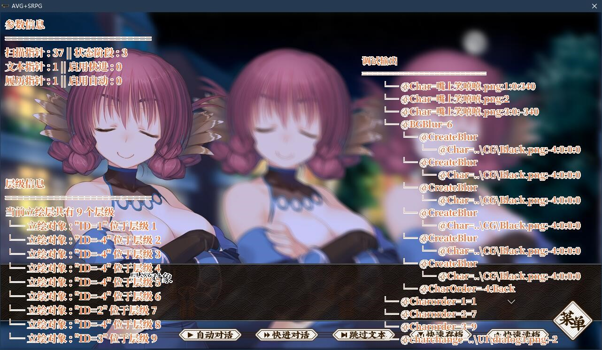

#### 开始调试

##### 说明

除了通过常规方式来对进行调试外，还可以使用下列方式快速启动对特定章节的调试：

##### 快速调试

将需要调试放置于`data\dialogue`文件夹的根目录下，在`Settings.ini`的`[Debug]`组`Debug_AVG`项中指定调试脚本名。运行主程序，在引擎信息/制作组信息页面按下`~/·`，以进入调试。若未指定脚本名，则默认启动对`_initial.asc`的调试

一个典型的配置如下：

```ini
[Debug]
;------------调试模式------------
在这里定义是否显示调试参数
Debug = 1

在这里定义调试重定向章节
Debug_AVG = Chapter_1
```

##### 拖拽调试

将需要调试的章节拖拽至主程序图标上使用其打开，即可对该章节进行调试

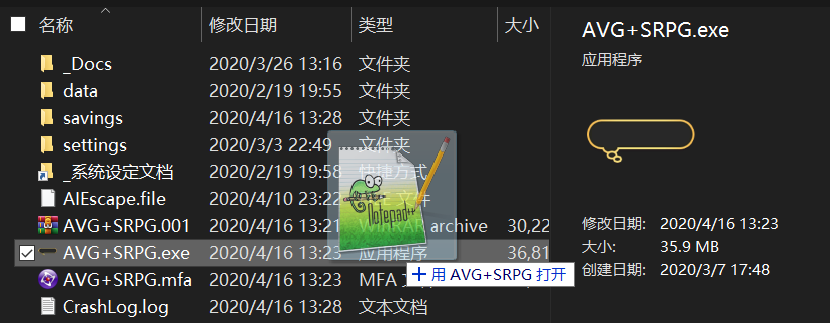

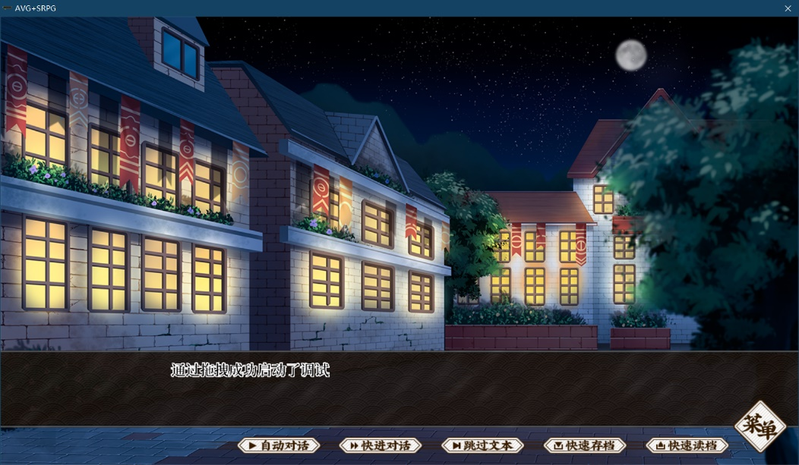

该调试方法所执行的完整命令行和目标脚本文件会被记录在`Settings.ini`->`Debug`一节中的`CommandLine`和`TargetScript`项

##### 通过文件关联调试

拖拽调试的本质是解析命令行，因此可以通过配置文件关联来实现快速调试。选中脚本文件，右键点击，选择打开方式，指定为主程序，即可通过双击打开脚本来进行调试。

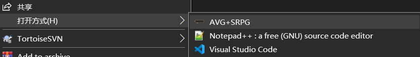

##### 使用编辑器调试

###### 自动

若安装了`AvgScript`扩展，**打开需要调试的脚本**，即可在编辑器内按下F5直接启动调试

###### 手动

拖拽调试的本质是解析命令行，因此可以通过配置编辑器来实现快速调试。以VSCode为例，依照范例定义`Launch.json`，将`{Your Project Name}`替换为实际名称，安装[C++扩展集合](https://marketplace.visualstudio.com/items?itemName=ms-vscode.cpptools-extension-pack)，并**打开需要调试的脚本**，即可在编辑器内按下F5直接启动调试

```JSON
"configurations": [
  {
    "name": "{Your Project Name} Debug",
    "type": "cppvsdbg",
    "request": "launch",
    "program": "{Your Project Path}/{Your Project Main Program}.exe",
    "args": ["${file}"],
    "stopAtEntry": false,
    "cwd": "${workspaceFolder}",
    "environment": [],
    "externalConsole": false
  }
]
```

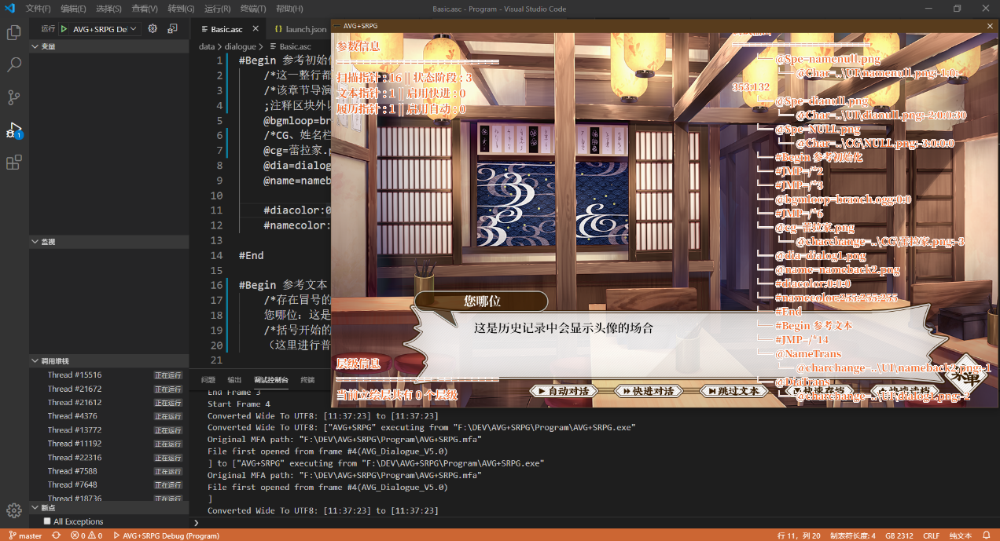

#### 快捷键

##### AVG

###### 复制调试信息

`Shift + C`: 将调试信息复制到剪贴板

###### 显示/隐藏调试信息

`Shift + W`: 显示/隐藏调试信息

###### 显示/隐藏边界

`Shift + H`: 头像栏边界
`Shift + H + Z`: 头像边界

`Shift + N`: 姓名边界
`Shift + N + Z`: 姓名栏边界

`Shift + D`: 对白边界
`Shift + D + Z`: 对话框边界

`Shift + B`: 选项边界
`Shift + G`: 图像对象边界
`Shift + S`: 字符串对象边界

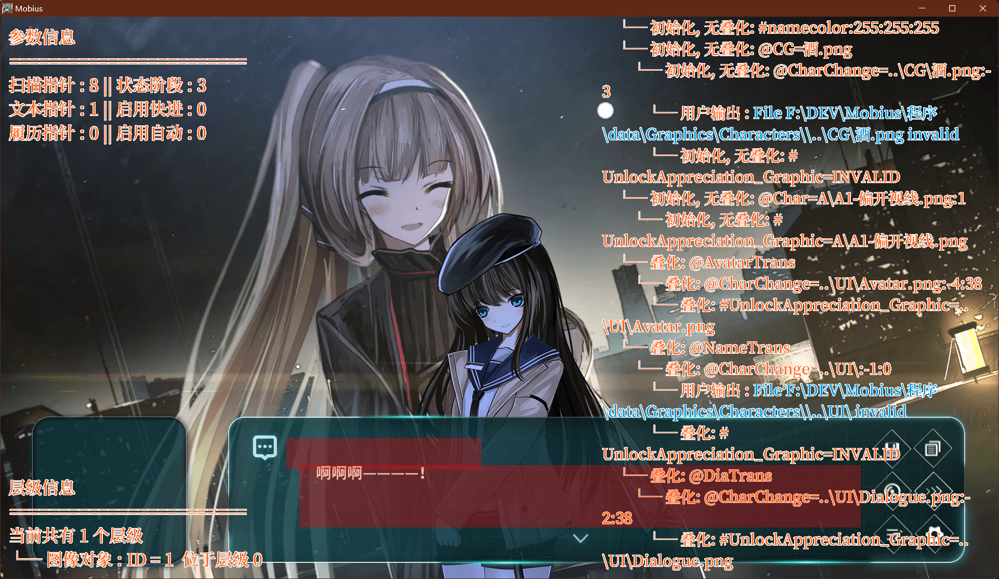

###### 显示/隐藏标尺

`Shift + R`: 标尺

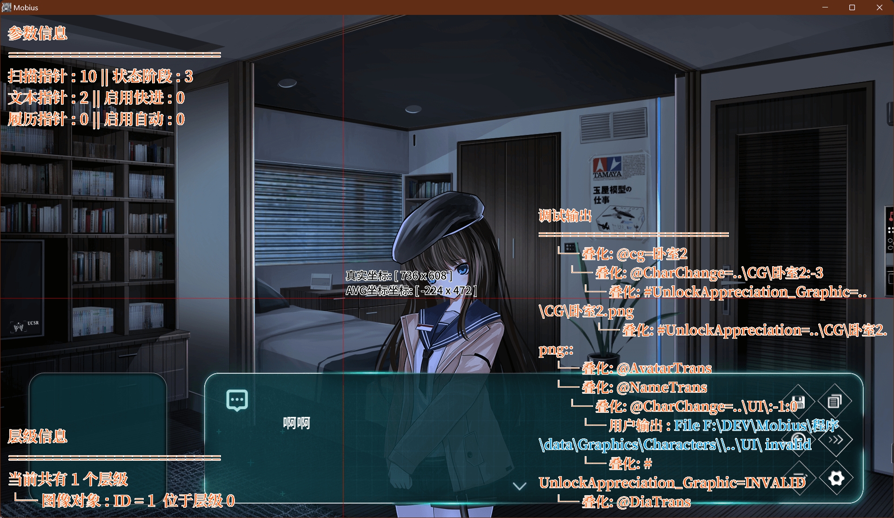

##### S/L

###### 强制读取

调试模式下按住`Shift`并点击读取按钮，可以无视存档验证读取存档，但可能会导致非预期的演出问题

###### 刷新

当前存档对应的文件来自于拖拽调试时，调试模式下按住`Ctrl`并点击存档底板，可强制刷新对应的原始文件，成功时会听到读取提示音

### 设置

```ini
; Coef & Max 用于将Cursor_Value归一化到0 ~ 100
; Cursor_Value = (Max - Save_Value) / Coef
; Save_Value = Max - Cursor_Value * Coef

; 在这里设定对话文字显示速度，单位：毫秒
Speed = 0
Speed_Coef = 2
Speed_Max = 200

; 在这里设定文本是否直接显示
ShowAll = 0

; 在这里设定是否启用自动模式
Auto = 1

; 在这里设定自动模式下对话显示完成之后切换的间隔
Wait = 1000
Wait_Coef = 40
Wait_Max = 5000

; 在这里设定是否跳过已读文本
; 跳过已读 = 0
; 跳过全部 = 1
FFJumpAll = 1

; Obsolete_在这里设定是否启用快捷栏
QuickBar = 1
```

## 发行

1. 在全局事件->全局_数据初始化->Release Key中指定使用的加密Key
2. 生成应用程序，使用`ContentGenerator.bat`生成实际发行版本并移除非必要文件
3. 对生成的可执行程序进行处理，如增加DRM壳。若启用了`HashVerification`，则需要验证其哈希并将结果填入`ExeHash`
4. 使用附带的Encrypter加密文件
   1. `settings`
      1. `settings\settings.ini`
      2. `settings\settings_Template.ini`
   2. `savings`
      1. `savings\_Global`
         1. `savings\_Global\_GlobalProgress`
         2. `savings\_Global\Appreciation_Definition`
         3. `savings\_Global\Appreciation_Progress`
         4. `savings\_Global\Data_Template.sav`
      2. `savings\_Sys`
         1. `savings\_Sys\Null.png`
   3. `localization`
      1. `localization\Localization.dat`
   4. `data`
      1. `data\Assets\`
         1. `data\Assets\Movies\*.*`
         2. `data\Assets\Fonts\*.*`
      2. `data\audio\*.*`
      2. `data\dialogue\*.*`
      3. `data\Graphics`
         1. `data\Graphics\FX\*.*`
         2. `data\Graphics\PatternFade\*.*`
         3. `data\Graphics\UI\*.*`
         4. `data\Graphics\_Sys\*.*`
         5. `data\Graphics\CG\*.*`
         6. `data\Graphics\Characters\*.*`
5. 更新初始鉴赏`Appreciation_Progress`，用于解锁标题画面音乐等正常游玩不会被记录到的文件
6. 打包上传

## #系统指令

### 特殊

#### `#Error=ErrorPic.png`

内部指令，当引擎报错时会显示`Data\Graphic\_Sys`下对应的错误提示`ErrorPic.png`

该指令会

- 状态机更新至错误状态`-1`
- 无叠化显示错误信息
- 禁用所有按钮
- 隐藏UI

#### `#Eval=CommandToEval`

执行`CommandToEval`

#### `#EOF`

文件尾标志，普通模式下解析到该指令即返回报错信息`脚本文件结尾必须为有效跳转`，`Lite`模式下则为执行完成标记

#### `#NULL`

空指令，用于指令转译

#### 代码块

##### `#Begin` / `#End`

代码块开始/结束标志，允许你在编辑器中将代码段折叠，在引擎内部无任何效果

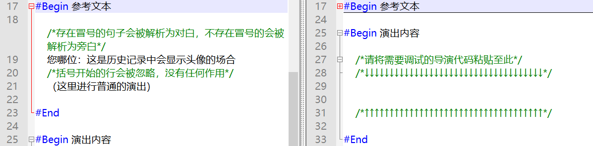

### 调试

#### 启用 / 关闭

##### `#Debug`

调试模式下无叠化显示调试参数

##### `#DebugOff`

调试模式下无叠化关闭调试参数

#### 调试信息

##### 说明

- 在调试模式下，引擎会自动输出包括转译指令在内的如下指令执行信息
- 父指令相关或转译的相关指令，会以缩进模式显示其层级关系

指令文件

```AvgScript
@Spe=namenull.png
@Char=..UInamenull.png:-1:0:-353:132
@Spe=dianull.png
@Char=..UIdianull.png:-2:0:0:30
@Spe=NULL.png
@Char=..CGNULL.png:-3:0:0:0

#begin 基本参数

  @NameChange=nameback2.png
  @DiaChange=dialog3.png
  @cg=西洋小镇_夜晚.png
  @CharChange=..CG西洋小镇_夜晚.png:-3
  
#end

@CharChange=..UIdialog3.png:-2
```

调试输出

```C++
========================
└─ @Char=Char_1.png:1
└─ @Char=Char_2.png:2:0:640
└─ @Char=Char_3.png:3:0:-640
└─ @MoveChar=1:-640:0
  └─ @MoveObj=4915274:0:398
  └─ @MoveObj=4849737:0:398
└─ @CharAllDispose
  └─ @CharDispose=3
    └─ @CharChange=null.png:3
  └─ @CharDispose=2
    └─ @CharChange=null.png:2
  └─ @CharDispose=1
    └─ @CharChange=null.png:1
```

##### `#MSG=Message`

仅调试模式下可用，于调试输出中输出Message

##### `#MSGRAW`

内部指令，仅调试模式下可用，于调试输出中输出内部变量，用于回避字符转义

##### `#MSGClear`

仅调试模式下可用，清空调试输出，在翻页时会自动调用

#### 快进控制

##### `#StopFF=IgnoreDebug`

同义指令

- `#StopFastForward=IgnoreDebug`

解析至该语句后，快进将会在下一句文本处停止

默认仅调试模式下可用，`IgnoreDebug`为`1`时在通常模式下也可用

### 缓存

#### `#CacheClean=MemLimit`

尝试清理未引用的缓存，直到当前内存占用低于`MemLimit`或无可清理缓存。`MemLimit = -1`将按照默认设置清理，`MemLimit = 0`将清理全部未引用缓存
注意:内存的分配与释放非常耗时，清理100MB内存大约需要10ms，可在黑屏淡出时进行清理，以避免可感知的卡顿，同时请尽量避免频繁清理

### 色调

#### `#DefineRGB=R:G:B` / `#DefineRGB=#FFFFFF`

定义立绘的色调RGB值为`R:G:B/#FFFFFF`，无叠化更新所有立绘对象(非特殊非特效对象)的RGB参数。该指令通常用于根据背景光照情况调整立绘色调，可使用附带的`RGBDefiner`工具来直观的调整该参数。

### 文本

#### `#TextAlign=Align:Type:ID`

设定对齐方式

`Type`为`Str`时，要求`ID`参数，作用于该`ID`对应的字符串对象

#### Align

- Left
- Center
- Right
- Top
- VCenter
- Bottom

#### Type

- Name
- Dia
- Str

#### `#TextSpace=SpaceType:Space:Type:ID`

设置行/列间距

`Type`为`Str`时，要求`ID`参数，作用于该`ID`对应的字符串对象

#### SpaceType

- Row
- Col

#### Type

- Name
- Dia
- Str

### 对白 / 姓名

#### `#DiaColor=R:G:B` / `#DiaColor=#FFFFFF`

定义对白文字的RGB值，`R:G:B/#FFFFFF`

字体颜色无法设置为`(255,255,255)/#FFFFFF`，否则会导致勾边错误

#### `#NameColor=R:G:B` / `#NameColor=#FFFFFF`

定义姓名文字的RGB值，`R:G:B/#FFFFFF`

字体颜色无法设置为`(255,255,255)/#FFFFFF`，否则会导致勾边错误

#### `#DiaSize=size`

定义对白文字的大小，AVG模式下默认大小为17，VN模式下默认大小为18

#### `#NameSize=size`

定义姓名文字的大小，默认大小为18

#### `#DiaFont=font`

定义对白文字的字体

#### `#NameFont=font`

定义姓名文字的字体

### 字体勾边

#### 说明

字体勾边通过Shader实现，Shader具有两个可供指令控制的参数：

- `Pixel color`：决定勾边像素的颜色(`color`)
- `Pixel outline`：决定勾边像素的个数(`OutlinePixel`)

此外，Shader还具有两个内部参数：

- `Active`：控制Shader的启用与否
- `Alpha`：控制字符串的不透明度

#### 姓名

##### `#NameShaderOn=OutlinePixel:R:G:B` / `#NameShaderOn=OutlinePixel:#FFFFFF`

启用姓名勾边，勾边颜色为`RGB/#FFFFFF`，勾边像素数为`OutlinePixel`

##### `#NameOutColor=R:G:B` / `#NameOutColor=#FFFFFF`

启用勾边时，更改姓名勾边颜色为`RGB/#FFFFFF`

##### `#NameOutPixel=OutlinePixel`

启用勾边时，更改对白勾边像素数为`OutlinePixel`

##### `#NameShadow=On/Off`

打开或关闭阴影模式，该模式仅在描边启用时有效

##### `#NameShaderOff`

关闭姓名勾边效果

#### 对白

##### `#DiaShaderOn=OutlinePixel:R:G:B` / `#DiaShaderOn=OutlinePixel:#FFFFFF`

启用对白勾边，勾边颜色为`RGB/#FFFFFF`，勾边像素数为`OutlinePixel`

##### `#DiaOutColor=R:G:B` / `#DiaOutColor=#FFFFFF`

启用勾边时，更改对白勾边颜色为`RGB/#FFFFFF`

##### `#DiaOutPixel=OutlinePixel`

启用勾边时，更改对白勾边像素数为`OutlinePixel`

##### `#DiaShadow=On/Off`

打开或关闭阴影模式，该模式仅在描边启用时有效

##### `#DiaShaderOff`

关闭对白勾边效果

#### 跳过

##### `#UnSkipAble`

读取到该指令后，当前章节无法使用跳过按钮/快捷键跳过

##### `#SkipAble`

允许当前使用跳过按钮/快捷键跳过，用于取消`#UnSkipAble`

### 全局Offset

#### `#SGO=XOffset:YOffset`

同义指令

- `#SetGlobalOffset=XOffset:YOffset`

设定演出对象的全局偏移量，特效、UI与字符串对象不受影响

### 叠化指令

#### 启用

##### `#FNT`

同义指令

- `#ForceNoTransition`

强制无叠化，强制无叠化状态在解析到文本后重置为关闭

##### `#FNTO`

同义指令

- `#ForceNoTransitionOff`

关闭强制无叠化

#### 速度

##### `#TransitionSpeed=Value`

更改叠化速度，默认为`10`，参数设定为`default`可重置默认值

##### `#SeparateTransitionSpeed=ID:Type:Value`

更改对象叠化速度，默认为`10`，参数设定为`default`可重置默认值

该值不为零时，会在叠化阶段覆盖全局叠化速度，并在叠化阶段结束后重置为零

#### 强制叠化

##### `#ForceTransition`

该指令会截取当前窗口，并按照`TransitionSpeed`指定的速度进行淡出，用于为无法创建叠化的指令(如`@Order`、`#DefineRGB`等)强制添加叠化

### 中断指令

#### `#Save`

保存中断存档

### 转译指令

#### 说明

用于将特殊指令转译为通用指令，例如将UI、CG等图像的专有创建指令转译为通用的图像创建指令，具体参数于代码中指定，无法通过脚本指令控制(但是可通过脚本激活，故以下指令请勿使用)

转译结束后指令会被重置为空指令`#NULL`

#### 特殊图像指令

##### `@Spe`

| 创建对象 | 文件名      |
| -------- | ----------- |
| @Spe     | dialog2.png |

该指令在调用前会在引擎内部更新`CoefStr`、`FolderStr`参数，定义转译后指令的文件路径、参数。**该指令为内部指令，请避免在脚本中使用。**

以使用内部指令`@Spe=dialog2.png`创建对话框为例

指令会被转译为`@Char=FolderStr+dialog2.png+CoefStr`，执行后更新相应参数

### 等待指令

#### 说明

等待指令会在该指令前的叠化指令完成后，等待指定的时间，等待结束后再继续解析操作

#### `#WaitGeneral=Time`

等待指令的公共调用，处理初始化、等待时间与状态机

#### `#W=2000`

同义指令

- `#Wait=2000`

等待指令:等待时间

等待指令只对**交叠淡化**有效

等待时间为零时，则会在当前叠化指令完成后立即继续解析操作

#### `#FW=2000`

同义指令

- `#ForceWait=2000`

强制等待指令:等待时间

强制等待指令对**移动旋转、BGM淡出淡出**等有效

等待时间为零时，则会在当前叠化指令完成后立即继续解析操作

### 自动文本

#### `#AutoChangePage=Time`

该指令后的文本会在等待时间后自动换行，覆盖自动与手动翻页操作

若不指定Time，则会使用当前设置中的默认翻页延时

```AVGScript
    #AutoChangePage=1500
    ……1
    &……2
```

文本会先显示`……1`，等待1500毫秒，然后追加显示`&……2`，随后通常处理

### 文本速度

#### `#TextDisplaySpeed=Time`

`Time`为显示间隔的毫秒数，该指令会覆盖下一行文本的显示速度，无视设置中的`ShowAll`属性

### 跳转指令

#### `#JMP=Label`

脚本内跳转，跳转到指定的标签位

置跳转标志位为1，跳转标志位在解析到文本后重置为0

#### `#NJMP=Label`

检测并重置跳转标志位

若非跳转至此(跳转标志位等于0)，则跳转到指定的标签位，用于跳转后的再初始化

#### `#SJMP`

同义指令

- `#SkipJmp`

跳转到下一个跳转指令并重启扫描，内部指令，用于跳过文本功能

置跳转标志位为1，跳转标志位在解析到文本后重置为0

#### `#CJMP=Chapter`

同义指令

- `#JmpCha=Chapter`

跨章节跳转，更新`CurrentChapter`，跳转到章节`Chapter`

#### `#FJMP=TargetFrame`

同义指令

- `#JmpFra=TargetFrame`

跨场景跳转，跳转到场景`TargetFrame`，仅接受数字参数

#### 说明

- 脚本文件中**必须**包含指向下一场景/章节的**有效跳转指令**，否则引擎会报错

- AVG系统中跳转等功能的正常运行必须要求进行过预编译流程。跳转至下一章节时，引擎会自动执行预编译流程。若需要使用指令跳转至AVG场景，请跳转至AVG预编译场景

#### 场景编号与场景功能

场景列表如下

| 场景编号 | 场景功能        |
| -------- | --------------- |
| 1        | 引擎&制作组信息 |
| 3        | 标题画面        |
| 4        | AVG场景         |
| 5        | Transfer        |
| 6        | 保存与读取      |
| 7        | 设置            |
| 8        | 分支            |
| 10       | 旅途回想        |
| 11       | 图绘回廊        |
| 12       | 乐音绕梁        |
| 14       | 战斗准备        |
| 15       | SRPG系统        |
| 16       | 战斗结算        |

### 跳过终止

#### `#SkipAnchor`

该指令会被当作跳过终止指令处理。范例再初始化代码如下：

```AVGScript
#SkipAnchor

#NJMP=Init

#FNT
@CAD
@CG=BG_Indoor_HYBR_Cloudy_Noon.png
#TransitionSpeed=10
#FNTO

;Init
```

此外，除二次开发中扩展的指令，如下指令也作为跳过终止指令处理：

| 指令名称     | 指令别名                              |
| ------------ | ------------------------------------- |
| JMP          |                                       |
| NJMP         |                                       |
| SJMP         | SkipJmp                               |
| CJMP         | JmpCha                                |
| FJMP         | JmpFra                                |
| CreateSwitch |                                       |
| Call         |                                       |
| Ret          |                                       |
| StopFF       | StopFastForward                       |
| CMP          | CMPV/CMPValue                         |
| CMPAB        | CMPVAB/CMPValueAB/CMPVV/CMPValueValue |

### 函数调用

#### `#Call=Label`

使用`#Call=Label`指令调用位于`Label`处的代码段。该代码段必须位于`#EOF`之前，且必须以`#Ret`结尾

#### `#Ret`

返回当前`Label`代码段的调用位点

### 变量

#### 基本

当前版本共12个数值/字符串变量，可通过ID进行指定，ID从1开始。变量指令中，`Value`代表普通数值，`ValueID`代表变量ID

在指令中可使用`<VValueID>`替换变量，使用`<SValueID>`替换字符串，其中`ValueID`为需要替换的变量ID

更多替换规则请参见`正则替换`一节

#### 赋值

##### 通用

###### `#SV=ValueID:Value`

同义指令

- `#SetValue=ValueID:Value`

令`ValueID`=`Value`，若`Value`为数值(匹配`\+[0-9]+(.[0-9]+)?\|-[0-9]+(.[0-9]+)?\|[0-9]+(.[0-9]+)?`)，则为数值赋值，否则为字符串赋值

##### 数值

###### `#SVV=ValueIDA:ValueIDB`

同义指令

- `#SetValueValue=ValueIDA:ValueIDB`
- `#SVAB=ValueIDA:ValueIDB`
- `#SetValueAB=ValueIDA:ValueIDB`

`ValueIDA`=`ValueIDB`

##### 字符串

###### `#SSS=ValueIDA:ValueIDB`

同义指令

- `#SetStringString=ValueIDA:ValueIDB`
- `#SSAB=ValueIDA:ValueIDB`
- `#SetStringAB=ValueIDA:ValueIDB`

`ValueIDA`=`ValueIDB`

#### 计算

##### 加

###### `#VA=ValueID:Value`

同义指令

- `#ValueAdd=ValueID:Value`

`ValueID`=`ValueID`+`Value`

###### `#VAV=ValueIDA:ValueIDB`

同义指令

- `#ValueAddValue=ValueIDA:ValueIDB`

`ValueIDA`=`ValueIDA`+`ValueIDB`

##### 减

###### `#VS=ValueID:Value`

同义指令

- `#ValueSub=ValueID:Value`

`ValueID`=`ValueID`-`Value`

###### `#VSV=ValueIDA:ValueIDB`

同义指令

- `#ValueSubValue=ValueIDA:ValueIDB`

`ValueIDA`=`ValueIDA`-`ValueIDB`

##### 乘

###### `#VM=ValueID:Value`

同义指令

- `#ValueMul=ValueID:Value`

`ValueID`=`ValueID`*`Value`

###### `#VMV=ValueIDA:ValueIDB`

同义指令

- `#ValueMulValue=ValueIDA:ValueIDB`

`ValueIDA`=`ValueIDA`*`ValueIDB`

##### 除

###### `#VD=ValueID:Value`

同义指令

- `#ValueDiv=ValueID:Value`

`ValueID`=`ValueID`/`Value`

###### `#VDV=ValueIDA:ValueIDB`

同义指令

- `#ValueDivValue=ValueIDA:ValueIDB`

`ValueIDA`=`ValueIDA`/`ValueIDB`

#### 比较

##### 通用

###### `#CMP=ValueID:Value`

同义指令

- `#CMPV=ValueID:Value`
- `#CMPValue=ValueID:Value`

比较`ValueID`与`Value`的大小，若`Value`为数值(匹配`\+[0-9]+(.[0-9]+)?\|-[0-9]+(.[0-9]+)?\|[0-9]+(.[0-9]+)?`)，则与数值比较，否则与字符串比较

###### `#CMPGeneral=Value:Value`

不引用变量，直接比较两个值，规则与`#CMP`相同

##### 数值

###### `#CMPAB=ValueIDA:ValueIDB`

同义指令

- `#CMPVAB=ValueIDA:ValueIDB`
- `#CMPValueAB=ValueIDA:ValueIDB`
- `#CMPVV=ValueIDA:ValueIDB`
- `#CMPValueValue=ValueIDA:ValueIDB`

比较`ValueIDA`与`ValueIDB`的大小

##### 字符串

###### `#CMPSAB=ValueIDA:ValueIDB`

同义指令

- `#CMPStringAB=ValueIDA:ValueIDB`
- `#CMPSS=ValueIDA:ValueIDB`
- `#CMPStringString=ValueIDA:ValueIDB`

比较`ValueIDA`与`ValueIDB`的大小

##### `#je/ja/jb/jne=label`

比较结果等于/大于/小于/不等于时，跳转至`Label`

#### 特殊变量

必要时可以使用负数ID访问特殊变量，部分指令即使用负数ID+变量操作实现

| ID  | 名称         | 英文名称         |
| --- | ------------ | ---------------- |
| -13 | 通关周目数   | FinishCount      |
| -12 | 故事线       | StoryLine        |
| -11 | 当前场景分支 | CurrentBranch    |
| -10 | 回想模式     | RecallMode       |
| -9  | 执行跳转     | Jumped           |
| -7  | 日历日期     | Cale_Date        |
| -6  | 日历模式     | Cale_CaleMode    |
| -5  | 日历进度     | Cale_CaleProcess |
| -1  | 比较结果     | Calc_Result      |

### 选项分支

#### `#SetSwitchColor=R:G:B` / `#SetSwitchColor=#FFFFFF`

指定通常选项的颜色

该指令对所有选项生效，请在`#CreateSwitch`前调用

#### `#SetSwitchHoverColor=R:G:B` / `#SetSwitchHoverColor=#FFFFFF`

指定鼠标悬浮选项的颜色

该指令对所有选项生效，请在`#CreateSwitch`前调用

#### `#SetSwitchNegativeColor=R:G:B` / `#SetSwitchNegativeColor=#FFFFFF`

指定不可用选项的颜色

该指令对所有选项生效，请在`#CreateSwitch`前调用

#### `#SetSwitchShader=Outline:R:G:B` / `#SetSwitchShader=Outline:#FFFFFF`

指定通常选项的描边效果

该指令对所有选项生效，请在`#CreateSwitch`前调用

#### `#CreateSwitch=SwitchNum`

选项分支创建的入口指令，用于创建`SwitchNum`个分支

该指令会记录当前扫描指针位置，用于保存/读取

同时转义为`#Wait`来执行该指令前的其他带叠化指令的演出

#### `#Switch=X:Y:Text:Label`

控制创建的分支选项，指定其X/Y坐标，选项文本与跳转标签

如果跳转标签定义为`Negative`，则该选项设定为灰色，无效

#### 说明

- 在`CreateSwitch`指令后必须跟随与`SwitchNum`数量一致的`Switch`指令
- 创建分支会跳过叠化阶段，如有叠化需求，请在`CreateSwitch`指令前使用`#Wait`指令
- 选项分支不会直接保存，而是会记录入口指令的指针位置，在读取时还原该指针位置并重启扫描以重新创建选项，因此请勿在Switch指令中夹杂除普通注释外的其他指令，会导致这些指令的重复执行错误

#### 示例

```AVGScript
#SetSwitchColor=#F0F0F0
#SetSwitchHoverColor=#0000FF
#SetSwitchNegativeColor=#00FF00
#SetSwitchShader=3:#FF0000

#CreateSwitch=3
#Switch=0:465:直接结束:结束标签
#Switch=0:335:彻底搞晕:测试标签
#Switch=0:205:不可选择:Negative

;结束标签
#JmpFra=1

;测试标签
#JmpFra=15
```

### 场景分支

#### 说明

引擎允许定义一系列场景跳转表，用于供玩家选择在一系列剧情或战斗触发的先后顺序。分支与故事线默认均从0开始，一个典型的分支定义如下：

```INI
[Storyline_Num_Branch_Num]
; 在此处定义当前分支最大可触发数
Exit=Num

; 分支编号从零开始
; ------------
; 定义分支图，图片格式为.jpg
Img_0=Test
; 定义分支字符串
Str_0=这是不可用分支
; 定义是否启用分支
Deactivate_0=1
; 定义分支跳转场景
Frame_0=1
; 定义分支脚本
Script_0=
; ------------

......
```

若要为故事线5的分支4定义分支，则`GroupName`应定义为`[Storyline_5_Branch_4]`

### 鉴赏

#### `#UnlockAppreciation=ContentName:Page:Pos`

解锁位于`Page`页第`Pos`个指向`ContentName`的鉴赏，`Page`与`Pos`参数从零开始。留空`Page`与`Pos`参数时，若启用了映射且映射定义合法，则依照定义解锁；若未启用映射，则依照记录数值依此解锁。

该指令需要内部参数`AppreciationType`，因此不能直接调用，而是由下列指令转译后执行：

#### `#UnlockAppreciation_Chapter=ChapterName:Page:Pos`

于场景回想中解锁位于`Page`页第`Pos`个指向`ChapterName`的鉴赏。

含转译指令在内，解析到`#JMPFra`或`#JMPCha`指令后，会自动执行留空`Page`与`Pos`参数的指令

#### `#UnlockAppreciation_Graphic=GraphicName:Page:Pos`

于场景回想中解锁位于`Page`页第`Pos`个指向`GraphicName`的鉴赏。`ChapterName`应为`Characters`的相对路径，CG文件夹下的文件的完整`ChapterName`为`..CG\Graphic.png`

该指令会自动忽略非CG文件夹下的文件，同时会根据`Appreciation_Definition`中`Graphic_SeparateBG`的启用情况，根据`Appreciation_CGToBGList`决定当前文件是否作为背景进行鉴赏映射处理

含转译指令在内，解析到`@Char`或`@CharChange`指令后，会自动执行留空`Page`与`Pos`参数的指令。

#### `#UnlockAppreciation_Audio=AudioName:Page:Pos`

于场景回想中解锁位于`Page`页第`Pos`个指向`AudioName`的鉴赏。

含转译指令在内，解析到`@BGM`或`@BGMPre`指令后，会自动执行留空`Page`与`Pos`参数的指令

#### `#UnlockAppreciation_Video=VideoName:Page:Pos`

于场景回想中解锁位于`Page`页第`Pos`个指向`VideoName`的鉴赏。

含转译指令在内，解析到`@PlayVideo`、`@OpenVideo`或`@ChangeVideo`指令后，会自动执行留空`Page`与`Pos`参数的指令

#### 说明

当`Page`与`Pos`参数留空时，若指定了映射，则程序会依据映射进行解锁。若未指定映射，则程序会从对应的首个鉴赏栏位开始逐个解锁。

#### 定义

##### 基本定义

鉴赏定义于`savings\Global\Appreciation_Definition`文件中，一个典型的定义如下：

```INI
[Appreciation_Define]
; 定义场景回想中每个页面的标题是否显示"第X章":
Chapter_TitleCount=1

; 定义场景回想中每个页面的标题:
Chapter_Title_0=返去故乡

; 定义每个鉴赏页面的栏位数量:
Chapter_CurrentPosPerPage=24
Graphic_CurrentPosPerPage=8
Audio_CurrentPosPerPage=16

; 定义每个鉴赏页面是否启用映射:
Chapter_Mapping=1
Graphic_Mapping=1
Audio_Mapping=1

; 未定义映射时自动生成的记录数值，初始应为0:
Chapter_CurrentPos=0
Graphic_CurrentPos=0
Audio_CurrentPos=0
```

其中，`AppreciationType_CurrentPosPerPage`定义对应鉴赏页面的栏位数量，`AppreciationType_Mapping`定义对应鉴赏是否启用映射，若启用映射则需定义，具体定义方法请参考下一节。

##### 映射定义

若启用了映射，则需要在对应的`Appreciation_Mapping_AppreciationType`组中定义项目映射，一个典型的定义如下：

```INI
[Appreciation_Mapping_Chapter]
; 以InitChapter为例定义映射规则:

; 定义显示名称
InitChapter_Name=故事的开始

; 定义页面
InitChapter_Page=0

; 定义该项在页面的位置
InitChapter_Pos=5

[Appreciation_Mapping_Graphic]
; 图像映射无需设定_Name参数:
..\CG\InitGraphic_Page=0
..\CG\InitGraphic_Pos=0

[Appreciation_Mapping_Audio]
; 以EndlessShinyBlues为例定义映射规则:

; 定义显示名称
EndlessShinyBlues_Name=无尽闪亮的哀愁

; 定义页面
EndlessShinyBlues_Page=1

; 定义该项在页面的位置
EndlessShinyBlues_Pos=1
```

当`Content_Name`项留空时，程序会将指令参数`ContentName`作为默认名称。

#### 解锁记录范例

解锁鉴赏项目后会在`savings\Global\Appreciation_Progress`留下记录，一个典型的记录如下：

```INI
[Appreciation_Progress]
; 自动生成的页面位置记录数值，初始应为0:
Chapter_Page = 2
Graphic_Page = 1
Audio_Page = 0

; 未定义映射时自动生成的记录数值，初始应为0:
Chapter_CurrentPos = 0
Graphic_CurrentPos = 1
Audio_CurrentPos = 0

[Appreciation_Chapter]
InitChapter=1
Chapter_0_5_New=1
Chapter_0_5_Content=InitChapter
Chapter_0_5_Name=故事的开始

[Appreciation_Graphic]
..CGInitGraphic.png=1
Graphic_0_0_New=1
Graphic_0_0_Content= ..CGInitGraphic.png

[Appreciation_Audio]
EndlessShinyBlues.mp3=1
Audio_1_1_New=1
Audio_1_1_Content= EndlessShinyBlues.mp3
Audio_1_1_Name= 无尽闪亮的哀愁
```

解锁后即可在对应的鉴赏页面中进行查看：

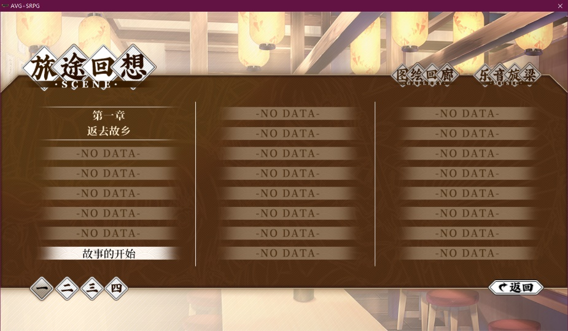

### Steam

#### `#UnlockAch=Steam_AchName`

解锁成就`Steam_AchName`

#### `#AddToStat=Steam_StatName:Steam_StatAdd`

更新统计`Steam_StatName`，增加`Steam_StatAdd`

若`Steam_StatAdd`留空，默认为统计量+1

## @控制指令

### 音频指令

#### 文件结构

音频文件位于`Data\Audio`路径下

| 类别 | 说明     |
| ---- | -------- |
| BGM  | 背景音乐 |
| BGS  | 背景声音 |
| SE   | 音效     |
| Dubs | 语音     |

#### 音频通道

音频通道分独占与混合两类，其中独占通道一次只能播放一个音频，播放新的音频会终止旧音频的播放，用于BGM等不允许混合的类别。混合通道允许播放复数个音频，如音效

| 类别 | 说明     | 通道ID | 通道类别 |
| ---- | -------- | ------ | -------- |
| BGM  | 背景音乐 | 0      | 独占     |
| BGS  | 背景声音 | 1      | 独占     |
| Dubs | 语音     | 2      | 独占     |
| SE   | 音效     | 0      | 混合     |

#### 通用音频指令

##### `@P=filename.mp3:volume:channel:channelType:FadeIn`

同义指令

- `@play=filename.mp3:volume:channel`

在指定的频道内以指定的音量播放一次`Audio`文件夹下指定的音频文件

其中`volume`可以直接接受`BGM`、`BGS`、`SE`、`DUB`作为参数来返回对应通道的音量

##### `@Stop=channel:channelType:FadeOut`

停止特定通道的音频播放

#### BGM指令

##### `@bgm=filename.MP3:fadeSpeed:StartPoint:endpoint`

同义指令

- `@BgmLoop=filename.MP3:fadeSpeed:StartPoint:endpoint`

定义BGM的A-B循环，从起点开始循环播放到终点

淡入淡出速度为持续秒数，等待淡入淡出属于强制等待

循环起始点/循环终止点参数设定为零，引擎会进行整曲循环

##### `@BgmPre=filename.MP3:fadeSpeed:StartPoint:endpoint:PreludePoint`

同义指令

- `@BgmPreludeLoop=filename.MP3:fadeSpeed:StartPoint:endpoint:PreludePoint`

定义BGM有前奏的A-B循环，从前奏点开始播放，播放至循环终点后，在循环起点和循环终点间循环播放

淡入淡出速度为持续秒数，等待淡入淡出属于强制等待

循环起始点/循环终止点/前奏点参数设定为零，效果与上条指令一致

##### `@BgmFadeOut=fadeSpeed`

淡出BGM

淡入淡出速度为持续秒数，等待淡入淡出属于强制等待

##### `@BgmPause`

暂停BGM

##### `@BgmResume`

恢复BGM

#### BGS指令

##### `@bgs=filename.MP3:fadeSpeed`

同义指令

- `@BgsLoop=filename.MP3:fadeSpeed`

定义BGS，BGS默认循环播放，请确认BGS素材可无缝循环

淡入淡出速度为持续秒数，等待淡入淡出属于强制等待

##### `@BgsFadeOut=fadeSpeed`

淡出BGS

淡入淡出速度为持续秒数，等待淡入淡出属于强制等待

##### `@BgsPause`

暂停BGS

##### `@BgsResume`

恢复BGS

#### SE指令

##### `@se=filename.MP3`

播放SE

#### 语音指令

##### `@NTK=NowTalking:KeepSeq`

同义指令

- `@NTKChange=NowTalking:KeepSeq`

变更`NowTalking`的值，并且在下一句语音开始播放对应的语音文件，`NowTalking`默认从0开始。`KeepSeq`为真时，不会自动启用语音序列

##### `@SeparateNTKChange=CharName:NowTalking:KeepSeq`

变更角色`NowTalking`的值，并且在下一句语音开始播放对应的语音文件，`NowTalking`默认从0开始。`KeepSeq`为真时，不会自动启用语音序列

未启用`SeparateDubID`时，该指令依旧有效，但向未记录过登场角色的变更不会被保存。为下一行文本中的首次登场角色使用该指令是安全的

##### `@Dub=FileName:KeepSeq:KeepNTK`

同义指令

- `@DubPlay=FileName:KeepSeq:KeepNTK`

更新语音内容，该语音会在显示下一句文本时播放。`KeepSeq`为真时，不会自动禁用语音序列，`KeepNTK`为真时，不会递增指针

##### `@DubChapter=ChapterName`

更新`DubChapter`，默认为当前章节名

在调试外部文件时，可以使用该指令调用正确的语音文件

##### `@DubSeque`

启用语音序列，默认启用

`@NowTalking`指令会自动启用语音序列
`@DubPlay`指令会自动禁用语音序列

##### `@DubSequeOff`

禁用语音序列，默认启用

`@NowTalking`指令会自动启用语音序列
`@DubPlay`指令会自动禁用语音序列

##### `@DubSequePrefix=Prefix`

更新`DubSequePrefix`，将会更新`语音文件名`为`DubSequePrefix_NowTalking`

若`DubSequePrefix`为空，则`语音文件名`为`NowTalking`，无下划线

### 视频指令

#### 文件结构

视频文件位于`Data\Assets\Movies`路径下，支援非压缩或使用`Cinepak/Indeo`编码压缩的`AVI`格式，其他视频格式要求安装`Windows Media Player`及相应解码器。因此，如无特殊需求，请使用`AVI`作为视频格式。播放结束后，默认会显示视频的最后一帧

#### 执行逻辑

场景初始化时，视频对象会加载纯黑的`Null.avi`，用于初始化。

在读取到视频时，若当前已打开视频，引擎会先截取当前帧，并无叠化切换CG为该帧。之后引擎会打开新视频，抓取其首帧，同时令CG叠化至该帧。在CG叠化结束后，正式开始播放，同时叠化CG至`NULL.png`

在读取时，引擎会先抓取存档中的播放进度的帧，并令CG显示该帧，开始播放，同时叠化CG至`NULL.png`

#### 遮挡问题

视频位于全部对象的最下方，若需消除全部遮挡，请：

- 将姓名栏切换为透明图片`NameNull.png`
- 将对话框切换为透明图片`DiaNull.png`
- 将CG切换为透明图片`Null.png`
- 将角色切换为透明图片或销毁
- 销毁字符串对象
- 销毁过渡元件
- 不设置天气
- 隐藏UI

具体的层次序请参见附录

#### 基本

##### `@PV=FileName.AVI:StartPos`

同义指令

- `@PlayVideo=FileName.AVI:StartPos`

最基本的也是最简单的指令，从`StartPos`开始播放`FileName.AVI`，单位毫秒

等价于以下指令组合:

```AVGScript
@OpenVideo=FileName.AVI:StartPos
@VideoResume
```

##### `@ChangeVideo=FileName.AVI`

切换视频，新打开的视频会自动切换至当前视频的进度，用于无缝切换差分视频

若当前正在播放视频，则该指令转义为`@PlayVideo=FileName.AVI:CurrentVideoPosition`，否则转义为`@OpenVideo=FileName.AVI:CurrentVideoPosition`

视频的循环状态和循环叠化会被保留

##### `@OV=FileName.AVI:StartPos`

同义指令

- `@OpenVideo=FileName.AVI:StartPos`

打开视频至`StartPos`，但并不播放，需要播放时请使用`@VideoResume`

若已经打开了视频，会抓取旧视频的当前帧作为CG进行过渡，否则则抓取新视频的首帧作为CG进行过渡

##### `@CloseVideo_Core`

不考虑当前情况与过渡直接关闭视频，用于历史记录跳转等场合

##### `@CV`

同义指令

- `@CloseVideo`

抓取当前帧作为CG，并关闭视频

#### 控制

##### `@VR`

同义指令

- `@VideoResume`

继续播放视频

##### `@VP`

同义指令

- `@VideoPause`

暂停视频

##### `@VW`

同义指令

- `@VideoWait`

当前视频播放结束后才会进入下一阶段

##### `@VL`

同义指令

- `@VideoLoop=LoopTransition`

设定当前视频循环播放，若`LoopTransition = 1`，则会在循环结束时叠化至视频开头，适用于视频本身非无缝循环的场合

##### `@VideoFinish=CommandToExecute`

在视频播放结束后调用`#Eval=CommandToExecute`以执行特定命令

##### `@SVP=StartPos`

同义指令

- `@SetVideoPos=StartPos`

设置视频位置

##### `@IgnoreStaticVideo=On/Off`

忽略设置中的`StaticVideo`

不影响使用替换表达式获取设置中`StaticVideo`的值

##### `@VideoCache=FilePath`

缓存视频，用于节省读取加密视频的用时。非加密视频会直接读取磁盘，因此无需缓存

若运行于非加密模式或若视频已被缓存，则不会执行任何操作

##### `@VideoErase=FilePath`

清除已缓存的视频，若不指定`FilePath`，则会清除所有缓存的视频

当前正在被使用的视频不会被清除

#### 范例代码

建议使用单独的章节进行视频播放。

播放一个视频，在播放结束后自动跳转至后续章节/场景的范例导演代码如下：

```AVGScript
#Begin 参考视频播放

  /*使用黑色CG作为遮罩实现淡入效果*/
  @hideUI
  @cg=black.png
  #Wait
  @cg=null.png

  /*播放*/
  @PlayVideo=DemoVideo.avi
  @VideoWait

  /*另一种写法*/

  /*
  @OpenVideo=DemoVideo.avi
  @SetVideoPos=0
  @VideoResume
  @VideoWait
  */

  #Wait

  #JmpFra=1

  #EOF

#End
```

### 运动指令

#### `@MO=FixedValue:TarX:TarY:Time:FuncA:FuncB:Mode`

同义指令

- `@MoveObj=FixedValue:TarX:TarY:Time:FuncA:FuncB:Mode`

##### 指令说明

内部指令，`@MoveChar`与@`MoveStr`会被引擎转译为该指令执行

具体参数可参考`Utilities\Easing`中的辅助程序进行设置

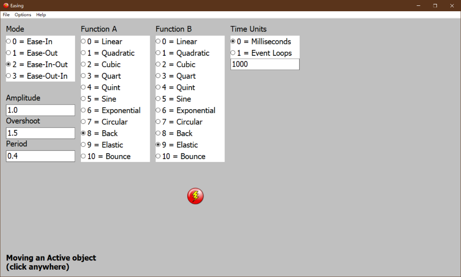

##### 参数说明

- FixedValue
  - 指向对象的指针，指令转译时自动指定

- TarX
  - 终点X坐标，支持真实坐标模式

- TarY
  - 终点Y坐标，支持真实坐标模式

- Time
  - 移动用时，单位毫秒，默认为1000

- Func
  - FuncA
    - 指定Ease-In函数，默认为Quint
  - FuncB
    - 指定Ease-Out函数，默认为Quint

- 支持的函数
  - 0 = Linear
  - 1 = Quadratic
  - 2 = Cubic
  - 3 = Quart
  - 4 = Quint
  - 5 = Sine
  - 6 = Exponential
  - 7 = Circular
  - 8 = Back
  - 9 = Elastic
  - 10 = Bounce

- Mode
  - 说明
    - 指定Ease模式，默认为Ease-Out

  - 全部支持的模式
    - 0 = Ease-In
    - 1 = Ease-Out
    - 2 = Ease-In-Out
    - 3 = Ease-Out-In

### 图像指令

#### 文件结构

图像文件位于`Data\Graphic`路径下

| 类别        | 说明                       |
| ----------- | -------------------------- |
| _Sys        | 报错信息                   |
| Characters  | 角色立绘                   |
| CG          | 背景或CG                   |
| UI          | 对话框/姓名栏              |
| PatternFade | 用于进行Pattern Fade的纹理 |
| FX          | 集中线等特效               |

#### 图像ID

图像ID与字符串ID相互独立，请勿与系统占用的ID(通常为负数)冲突，请参见附录`系统ID`一节

#### 自动捕获

##### 说明

若指令的ID参数指定为`<>`，则会自动捕获上一条指定了ID的指令对应的ID。即使上一条指令的ID不合法(如:没有对应的对象，占用了系统ID)，也会更新捕获

自动捕获不判定类型，捕获的字符串对象ID可用于指定图像对象ID(字符串对象和图像对象的ID相互独立)

```AVGScript
@Char=test block.png:1

//@CrossFade会自动捕获@Char中的对象ID，即1
@CrossFade=<>
```

```AVGScript
@Char=test block.png:1
@CrossFade=1
```

##### `#SetCapture=ID`

强制更新捕获ID为`ID`

在执行到下一个指定了ID的指令时，ID会被覆盖

##### `#CaptureSys=On`

是否捕获系统对象的ID，默认关闭

#### 控制指令

##### `@KeepRes=ID`

同义指令

- `@KeepResolution=ID`

该ID对应的对象会在叠化时保持当前设定的分辨率

##### `@KeepResOff=ID`

同义指令

- `@KeepResolutionOff=ID`

该ID对应的对象会在叠化时重设分辨率为新图像的分辨率

##### `@CrossFade=ID`

为该对象下次叠化启用交错模式

- ID留空，程序会尝试捕获最新调用叠化指令的对象
- 在叠化完成后，CrossFade会自动禁用
- 在叠化阶段开始指令前(等待/强制等待/文本)使用指令均有效，但从可读性角度建议写于相应叠化指令后

#### 特效指令

##### 震动控制

###### `@ShakeDir=Dir`

设置震动方向，`X=0`，`Y=1`

###### `@ShakeCoef=Strength`

设置震动强度

###### `@ShakeAttenuation=On`

设置震动幅度衰减，仅适用于模式0

###### `@ShakeAttenuationParam=FuncA:FuncB`

设置震动衰减Easing参数

##### 震动模式

###### `@Shake=5000`

模式0，震动一定时长后停止震动，单位为帧，通常情况下设定为60代表震动一秒

###### `@KeepShake`

模式1，持续震动

###### `@KeepShakeOff`

模式2，停止震动

##### 缩放

###### `@BackZoomParam=Easing_FuncA:Easing_FuncB`

指定进行缩放时的Easing参数

###### `@BackZoomReset=Speed:Instant:ForceWait`

按当前参数重置缩放，转译为指令`@BackZoom=0:0:ResolutionX:ResolutionY:Speed:Instant:ForceWait`，在真实坐标模式下执行

###### `@BackZoom=X:Y:width:height:Speed:Instant:ForceWait`

缩放到大小为`(width,height)`，区域中心坐标`(x,y)`指定缩放速度以及是否立即缩放

`ForceWait`参数为`0/1`，`0`表示默认在阶段二进行变化，`1`表示跨阶段变化

使用强制等待，可在缩放途中叠化图像

```AVGScript
@BackZoom=640:360:640:360:1:0:1
#wait=1000
@CGChange=夏.png
#ForceWait=1000
```

#### 过渡指令

##### `@Fade`

创建淡入淡出叠化效果，会被转译为`@PatternFade`

##### `@DestroyFade`

消除之前创建的所有叠化效果，会被转译为`@PatternFadeOut`

```AVGScript
@Fade
#wait=4000
@DestroyFade
```

##### `@PF=PicName:Orderable`

同义指令

- `@PatternFade=PicName:Orderable`

创建`Pattern`过渡元件，使用`PatternFade`读取`PicName`图像叠化进入，具有`Orderable`属性的对象可参与排序

##### `@PFO=PicName:Orderable`

同义指令

- `@PatternFadeOut=PicName:Orderable`

使用`PatternFade`读取`PicName`图像叠化退出使用`PatternFade`创建的对象，具有`Orderable`属性的对象可参与排序

该指令运行结束后会自动销毁该Pattern过渡元件

#### Pattern fade

##### 基本信息

模式0为默认模式，使用当前图像作为pattern，过渡到指定的贴图颜色

模式1为叠化模式，使用当前图像作为前景，提另读取贴图作为pattern，由前景过渡至背景

##### 说明

左为pattern Fade In，右为pattern Fade Out,前景pattern Fade In=背景pattern Fade Out,前景pattern Fade Out=背景pattern Fade In。**两者虽然采用了不同的叠化方式，但最终效果一致，建议使用前者。**

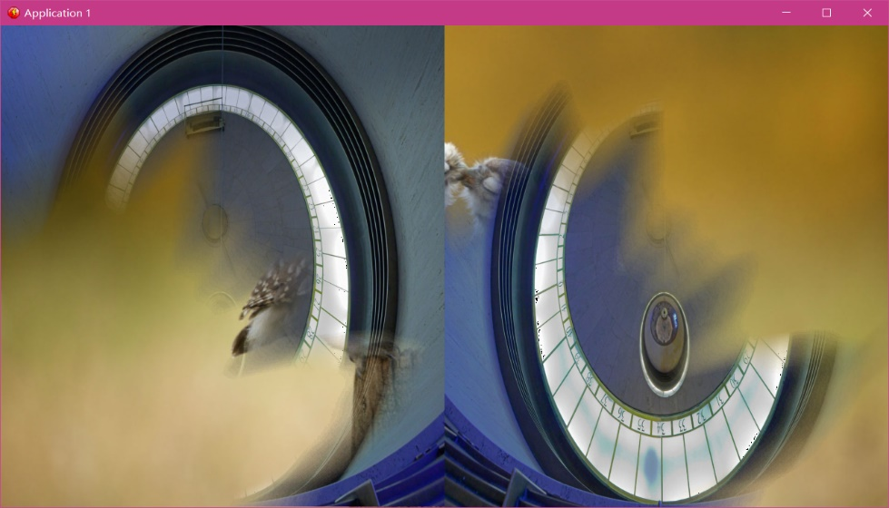

##### 核心指令

###### `@CPF=PicName:PatternName:ID`

同义指令

- `@CPatternFade=PicName:PatternName:ID`

读取贴图，前景背景同时叠化

###### `@CPFI=PicName:PatternName:ID`

同义指令

- `@CPatternFadeIn=PicName:PatternName:ID`

读取贴图，叠化至前景图像

###### `@CPFO=PicName:PatternName:ID`

同义指令

- `@CPatternFadeOut=PicName:PatternName:ID`

读取贴图，叠化至背景图像

##### 转译指令

###### `@CharPF=PicName:PatternName:ID`

同义指令

- `@CharPatternFade=PicName:PatternName:ID`

转译指令，读取贴图，叠化至前景图像。**不建议进行差分和不同对象的切换，而是将当前图像切换至透明图像来实现进场和退场效果**

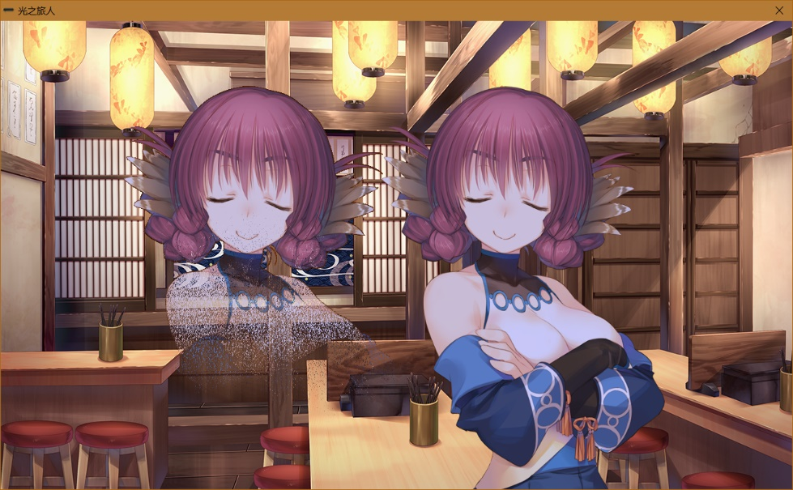

###### `@CGPFI=PicName:PatternName`

同义指令

- `@CGPatternFadeIn=PicName:PatternName`

转译指令，读取贴图，CG叠化至前景图像

###### `@CGPFO=PicName:PatternName`

同义指令

- `@CGPatternFadeOut=PicName:PatternName`

转译指令，读取贴图，CG叠化至背景图像

#### 特效对象

##### 景深对象

###### `@AddBlur=Num`

`@AddBlur`会转译为`Num`个`@CreateBlur`指令，创建结束的景深对象默认位于演出对象最下方。`Num`数值越大，模糊效果越强，留空默认为1

可使用`@Order`指令控制景深对象次序，使用`@CharAllDispose`指令不会销毁景深对象。请勿使用`@CharDispose`指令销毁，该方法会破坏景深堆栈指针

###### `@CreateBlur`

创建带有背景模糊的景深对象，对象保存至景深堆栈，默认ID从`-100`开始递减

该指令创建的景深对象位于演出对象最下方

###### `@RemoveBlur=Num`

`@RemoveBlur`会转译为`Num`个`@DestroyBlur`指令，欲销毁全部景深对象，请将`Num`设定为一个较大的数，如`255`，实际指令转译最大只会进行当前景深对象数(即景深堆栈深度)次

###### `@DestroyBlur`

移除景深堆栈最上方的景深对象

###### 示意图


##### Sepia Toning

###### `@Sepia=Strength:NoiseMotion:Period`

同义指令

- `@SepiaToning=Strength:NoiseMotion:Period`

创建强度为`Strength`的`Sepia Toning`对象，对象默认ID为`-5`。其中`Strength`应为一个`[0,1]`的浮点数，默认值为`0.5`，`NoiseMotion`参数控制噪声运动的开启与关闭，当设定为`1`或`On`的时候会启用噪声运动，运动周期为`Period`，单位毫秒，默认值为`-1`，即每帧更新。已经创建了`Sepia Toning`对象后调用该指令，该指令无效。

###### `@ChangeSepiaStrength=Strength`

在演出执行阶段改变`Sepia Toning`对象的`Strength`，参数留空会将`Strength`设定为默认值`0.5`

###### `@SetSepiaNoiseMotion=On/Off`

控制噪声运动的开启与关闭，设定为`1`或`On`时启用噪声运动，设定为`0`或`Off`时禁用噪声运动，参数为空会Toggle当前启用状态

###### `@ChangeSepiaNoiseMotionPeriod=Period`

将噪声运动的运动周期设定为`Period`，单位毫秒，参数为空会将`Period`设定为默认值`-1`，一个典型的参考值为`300`毫秒

###### 噪声图

一个典型的噪声图为使用PhotoShop创建一个与画面分辨率一致的，填充纯黑色，并添加30%高斯分布杂色的图像，参考图如下：


###### 使用建议

`Sepia Toning`建议结合遮罩使用，一个典型的遮罩如下图所示：


###### 范例代码

```AVGScript
Sepia Toning
@SepiaToning=0.5:On:500
@Char=..FXMemory.png:20:0:0:0

ChangeSepiaNoiseMotionPeriod
@ChangeSepiaNoiseMotionPeriod

Change Sepia Strength
@ChangeSepiaStrength=1

Set Sepia Noise Motion
@SetSepiaNoiseMotion=On

Toggle Sepia Noise Motion
@SetSepiaNoiseMotion

@CharDispose=-5
@CharDispose=20
```

###### 示意图

附加遮罩

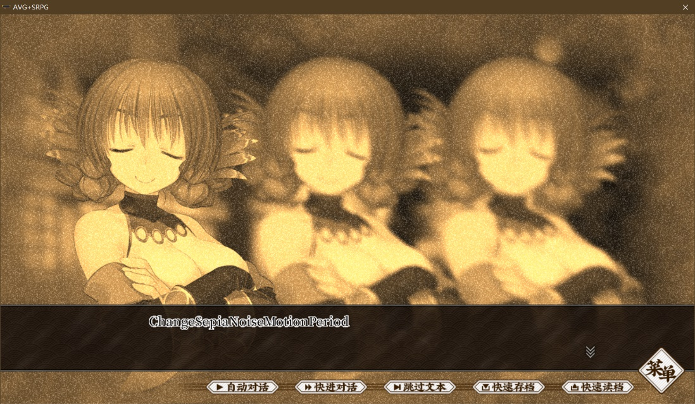

不附加遮罩

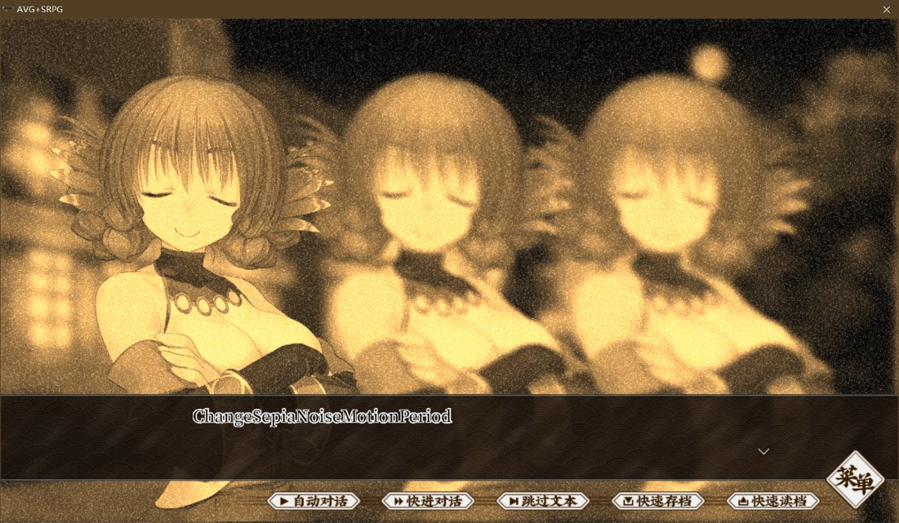

#### 图像指令

##### `@Char=filename.png:ID:Alpha:X:Y:Width:Height`

同义指令

- `@Character=filename.png:ID:Alpha:X:Y:Width:Height`

| 显示立绘   | 文件名        | ID  | 不透明度 | X坐标 | Y坐标 | 长  | 宽  |
| ---------- | ------------- | --- | -------- | ----- | ----- | --- | --- |
| @character | char1正常.png | 1   | 120      | 250   | 0     | 800 | 720 |
| 1          | 2             | 3   | 4        | 5     | 6     | 7   | 8   |

- 该指令用于创建图像
- 留空文件后缀名时，会默认图片格式为PNG
- 不透明度范围为0~255
- 文件名支持使用../返回上级路径
- 坐标系以画面中央底部为原点
- 坐标以图像中央底部为热点
- 长宽默认为图片原始尺寸
  - 使用+/-指定增量时，会以原始尺寸为基础进行计算

##### `@CC=filename:ID:alpha:width:height`

同义指令

- `@CharChange=filename:ID:alpha:width:height`

| 切换立绘    | 文件名        | ID  | 不透明度 | 长  | 宽  |
| ----------- | ------------- | --- | -------- | --- | --- |
| @CharChange | char1正常.png | 1   | 120      | 800 | 720 |
| 1           | 2             | 3   | 4        | 5   | 6   |

- 该指令用于切换为其他角色或动作
- 留空文件后缀名时，会默认图片格式为PNG
- 不透明度范围为0~255，该指令会重置`@CharAlpha`设定的不透明度
- 文件名支持使用../返回上级路径
- 交错模式
  - 通常来说，切换角色时应启用交错模式
  - 更改长宽比时，会自动切换为交错模式
- 长宽默认为新图片原始尺寸
  - 使用+/-指定增量时，会以原始尺寸为基础进行计算

##### `@CA=ID:Alpha`

同义指令

- `@CharAlpha=ID:Alpha`

切换对象到指定的不透明度

##### `@HideChar=ID`

若`PreviousAlpha = -1`，记忆当前的目标不透明度，并执行`@CharAlpha=ID:255`

##### `@HideAllChar`

为所有未隐藏的图像对象执行`@HideChar=ID`

##### `@ShowChar=ID`

执行`@CharAlpha=ID:PreviousAlpha`还原已隐藏的图像对象的目标不透明度，并重置`PreviousAlpha = -1`

##### `@ShowAllChar`

为所有隐藏的图像对象执行`@ShowChar=ID`

##### `@CD=ID`

同义指令

- `@CharDispose=ID`

销毁并释放该ID对应的图像对象的本体和遮罩，会转译为`@CharAlpha=ID:255`并启用`Destroy`Flag

##### `@CAD`

同义指令

- `@CharAllDispose`

销毁全部的图像对象，并释放其对应的本体和遮罩

CG/UI不会被销毁

##### `@MC=ID:TarX:TarY:Time:FuncA:FuncB:Mode`

同义指令

- `@MoveChar=ID:TarX:TarY:Time:FuncA:FuncB:Mode`

移动图片对象，具体参数说明请参见`@MoveObj`一节

##### `@CharRotate=ID:angle:clockwise:CircleCount`

旋转对象至目标角度与预定圈数，`clockwise = 1`为顺时针，`clockwise = -1`为逆时针

若目标角度设定为360度，旋转0圈，将持续旋转

该指令不可与立绘叠化同时使用

##### `@CharBlur=ID:Radius`

为角色创建模糊效果

会在库中缓存访问文件名为`RelativePath_Blur_Radius`的文件

##### `@SetAutoArrange=On/Off`

控制自动间距功能的开启与关闭，设定为1或On时启用自动间距，设定为0或Off时禁用自动间距，参数为空会Toggle当前启用状态

启用自动间距后，新建/销毁立绘时会自动调整间距，最大支持处理六张立绘的间距

##### `@AttachShader=ID:ShaderName:Param1:Param2:...`

为非特效图像附加Shader，依照内部顺序指定参数

#### UI / CG指令

##### 说明

程序会**自动对姓名栏、对话框与CG初始化为对应的NULL透明图片**，**请勿移除NULL文件，否则显示会出现偏移**。需要变更时，请使用本节指令进行指定

通常情况下，UI变更会在叠化阶段与其他图像叠化同时进行，若需要UI变更**在其他图像叠化完成后进行**，请**在需要等待的文本前追加#Wait指令**

##### `@CG=filename.png`

同义指令

- `@CGChange=filename.png`

切换CG，叠化阶段进行

由于视频指令会在特定时刻更新CG，故该指令会在视频打开时调用`@CloseVideo_Core`关闭视频，避免两者冲突

##### `@dia=filename.png`

同义指令

- `@DiaChange=filename.png`

切换对话框，解析到文本后进行，调用指令`@DiaTrans`

##### `@DiaTrans=force`

内部转译指令，判定并更新对话框

`force` = `1`时，强制执行叠化

##### `@name=filename.png`

同义指令

- `@NameChange=filename.png`

切换姓名栏，解析到文本后进行，调用指令`@NameTrans`

##### `@NameTrans=force`

内部转译指令，判定并更新姓名栏

`force` = `1`时，强制执行叠化

##### `@StashUIGraphic`

保存UI图像，用于在`@TextFadeOut`后还原

##### `@RestoreUIGraphic`

还原`@StashUIGraphic`保存的信息

##### `@TextFadeOut`

该指令会自动转译为

```AVGScript
@StashUIGraphic

@Name=NameNull.png
@NameTrans
@Dia=DiaNull.png
@DiaTrans

...
```

将姓名栏、对话框及相应的文本淡出，适用于VNMode

##### `#DisableUI`

禁用UI

##### `#EnableUI`

启用UI

##### `#UpdateUICoord=Forced:CoordOnly`

相对对话框更新UI坐标，`Forced = 1`时强制更新，`CoordOnly = 1`时不更新不透明度

##### `#HideUI`

无叠化，隐藏菜单与快捷栏，会自动转译`#DisableUI`

##### `#ShowUI`

无叠化，重新显示菜单与快捷栏，会自动转译`#EnableUI`

### 字符串指令

#### `@Str=string:ID:TypeEffect:Alpha:x:y:size:font:R:G:B` / `@Str=string:ID:TypeEffect:Alpha:x:y:size:font:#FFFFFF`

同义指令

- `@String=string:ID:TypeEffect:Alpha:x:y:size:font:R:G:B`
- `@String=string:ID:TypeEffect:Alpha:x:y:size:font:#FFFFFF`

- `@CreateStr=string:ID:TypeEffect:Alpha:x:y:size:font:R:G:B`
- `@CreateStr=string:ID:TypeEffect:Alpha:x:y:size:font:#FFFFFF`

- `@CreateString=string:ID:TypeEffect:Alpha:x:y:size:font:R:G:B`
- `@CreateString=string:ID:TypeEffect:Alpha:x:y:size:font:#FFFFFF`

| 指令 | 文本 | ID  | 打字效果 | 不透明度 | x坐标 | y坐标 | 字号 | 字体 | R        | G   | B   |
| ---- | ---- | --- | -------- | -------- | ----- | ----- | ---- | ---- | -------- | --- | --- |
| @str | 文本 | 1   | 1        | 120      | 250   | 0     | 22   | 黑体 | 0        | 0   | 0   |
|      |      |     |          |          |       |       |      |      | \#FFFFFF | N/A | N/A |
| 1    | 2    | 3   | 4        | 5        | 6     | 7     | 8    | 9    | 10       | 11  | 12  |

创建字符串，字符串ID与图像ID相互独立

除输入完整参数外，字符串参数还允许通过单独指令修改。在字符串创建的解析循环中进行的修改会作用于创建叠化，其余场合使用指令修改参数是否进行叠化请参考具体指令说明。

默认参数：

- 默认尺寸：
  - 字符串对象宽600
  - 字符串对象高60
- 默认不透明度`0`
- 默认底部居中
- 默认字号`22`
- 默认字体`黑体`
- 默认颜色
  - 黑色文字`RGB=(0,0,0)`
  - 白色勾边`RGB=(255,255,255)`

#### `@StrA=ID:120`

同义指令

- `@StrAlpha=ID:120`

切换对象到指定的不透明度

#### `@StrCenter`

定义坐标参数留空时字符串的默认位置

该指令后创建的字符串默认居中

#### `@StrBottom`

定义坐标参数留空时字符串的默认位置

该指令后创建的字符串默认底部居中

#### `@StrS=ID:Size`

同义指令

- `@StrSize=ID:Size`

无叠化，更改字符串字号

#### `@StrF=ID:Font`

同义指令

- `@StrFont=ID:Font`

无叠化，更改字符串字体

#### `@StrC=ID:R:G:B`

同义指令

- `@StrC=ID:#FFFFFF`
- `@StrColor=ID:R:G:B`
- `@StrColor=ID:#FFFFFF`

无叠化，更改字符串颜色

#### `@DestroyStr=ID`

同义指令

- `@DestroyString=ID`

销毁字符串

#### `@DestroyAllStr`

同义指令

- `@DestroyAllString`

销毁全部字符串对象

#### `@MS=ID:TarX:TarY:Time:FuncA:FuncB:Mode`

同义指令

- `@MoveStr=ID:TarX:TarY:Time:FuncA:FuncB:Mode`

移动字符串对象，具体参数说明请参见`@MoveObj`一节

坐标受`@StrCenter`参数影响

### 层级控制

#### `@Order=ID:Order:Type`

无叠化，调整ID指定对象的层级，通过`Type`指定不同的对象类型

`Type`为`Pic`则移动`ID`对应的图像对象，`Type`为`Str`则移动`ID`对应的字符串对象

#### `@Front=ID:Type`

无叠化，将`ID`指定的`Type`对象移至顶层

#### `@Back=ID:Type`

无叠化，将`ID`指定的`Type`对象移至底层

#### `@Forward=ID:Type:Num`

无叠化，将`ID`指定的`Type`对象上移`Num`层，参数留空默认上移一层

#### `@Backward=ID:Type:Num`

无叠化，将`ID`指定的`Type`对象下移`Num`层，参数留空默认下移一层

### 天气指令

#### 说明

- 当前存在天气效果时，需要先取消天气效果，才能更换新的天气
- 连续使用过渡指令会导致天气粒子创建或销毁错误，从而导致过渡效果消失
- 需要进行跳转的场合，请在跳转指令出口标签后使用普通天气指令重新指定天气，可参考自动语音序列相关内容进行配置

#### 普通指令

##### `@Rain`

立即创建下雨效果，允许连续使用

##### `@Snow`

立即创建下雪效果，允许连续使用

##### `@Normal`

立即取消天气效果，允许连续使用

#### 过渡指令

##### `@ToRain`

逐渐创建下雨效果，不会在过渡状态2等待，不受到强制等待指令控制

##### `@ToSnow`

逐渐创建下雪效果，不会在过渡状态2等待，不受到强制等待指令控制

##### `@ToNormal`

逐渐取消天气效果，不会在过渡状态2等待，不受到强制等待指令控制

## 附录

### 附带工具

在`Utilities`文件夹下附带了一些辅助工具

#### ContentGenerator

用于创建Steam生成版本所需Content的批处理

#### Easing

用于直观的指定Easing参数

#### Encrypter

基于Windows`CNG`(`Cryptography Next Generation`)API中`AES`算法的加密工具，用于对素材进行加密/解密，需要指定十六位的加密/解密Key

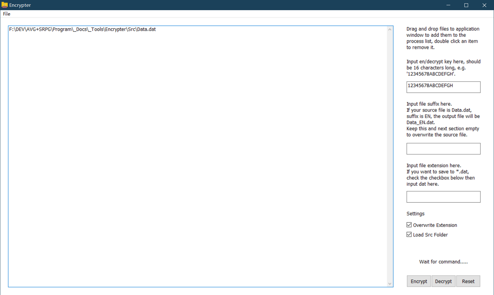

#### Encrypter_CLI

基于Encrypter的CLI版本，用于将加密整合至批处理，如`ContentGenerator`

| 命令              | 类别   | 说明                             |
| ----------------- | ------ | -------------------------------- |
| -f, --fileName    | option | 需要处理的文件                   |
| -o, --outFileName | option | 输出文件名，未指定则覆盖原始文件 |
| -k, --key         | option | 用于加密/解密的Key               |
| -e, --encrypt     | flag   | 加密文件                         |
| -d, --decrypt     | flag   | 解密文件                         |
| --hash            | flag   | 计算文件哈希                     |

#### PattenFadeViewer

快速查看不同纹理的PatternFade效果

#### RGBDefiner

用于直观的指定不同CG下立绘的RGB参数

#### ScriptConverter

用于转换剧本到导演代码的宏

#### Settings_CLI

使用命令行编辑ini文件，用于批处理，如`ContentGenerator`

| 命令              | 类别   | 说明                             |
| ----------------- | ------ | -------------------------------- |
| -f, --fileName    | option | 需要处理的文件                   |
| -o, --outFileName | option | 输出文件名，未指定则覆盖原始文件 |
| -s, --section     | option | 节                               |
| -i, --item        | option | 项                               |
| -v, --value       | option | 值                               |
| -u, --unicode     | flag   | 文件为Unicode                    |

### VSCode

#### 配置

1.安装[VSCode](https://code.visualstudio.com/)

2.在侧边栏中点击扩展按钮


3.在扩展页面中点击右上角的`...`打开二级菜单，选择`从VSIX安装`，安装提供的`AvgScript`插件

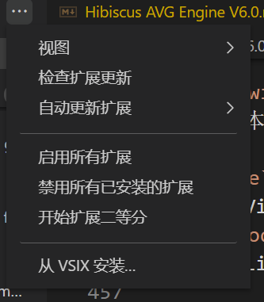

4.打开设置->颜色主题

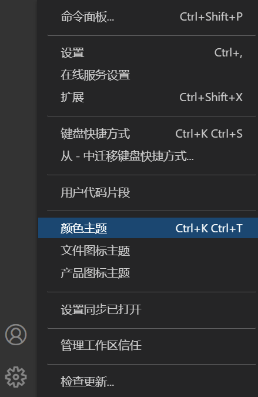

5.选择主题为`AvgScript`,这将为脚本带来语法高亮


6.打开资源管理器，导航至脚本所在的文件夹，在空白区域右键点击，选择`通过Code打开`

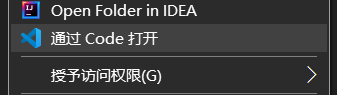

7.使用`Ctrl + Shift + P`组合键呼出命令面板，选择`AvgScript: Set Base path`:

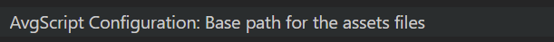

输入开发工程中主程序`Game.exe`的完整路径:

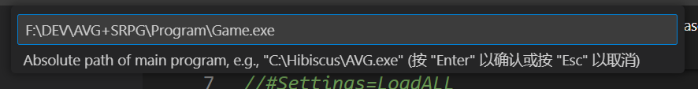

本例中主程序所在文件夹为`F:\DEV\AVG+SRPG\Program`，主程序为`Game.exe`，因此实际输入的路径应为`F:\DEV\AVG+SRPG\Program\Game.exe`

引擎会通过该路径查找资源文件并进行语法提示:

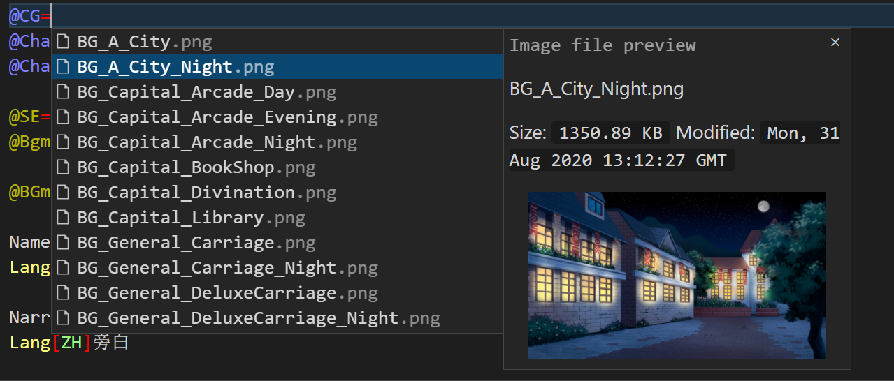

7.开始编辑

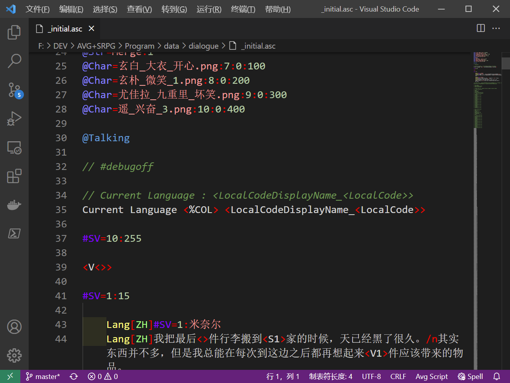

#### 设置

##### 命令扩展

插件仅包含了本文档中的指令，若在二次开发中扩展了自己的指令，可以通过编辑设置来指定这些指令的语法提示

##### 脚本生成

通过指定一组按顺序调用的正则表达式，通过替换从原始文本生成基础脚本，如通过编剧的演出提示替换为对应的指令

### AVG状态阶段

#### 基本阶段

AVG系统基本功能处理阶段

| 阶段 | 名称         | 说明                                                                |
| ---- | ------------ | ------------------------------------------------------------------- |
| -1   | 错误阶段     | 引擎报错即进入该阶段                                                |
| 1    | 指令解析阶段 | 解析脚本，并更新演出指令<br/>快进模式下会直接更新至演出结果         |
| 2    | 演出执行阶段 | 执行解析阶段更新的演出指令                                          |
| 3    | 等待操作阶段 | 演出结束，等待玩家操作<br/>自动/快进模式下条件符合时会自动返回阶段1 |

#### 其他阶段

AVG系统其他功能处理阶段

| 阶段 | 名称     | 说明                                 |
| ---- | -------- | ------------------------------------ |
| 11   | 菜单呼出 | 呼出菜单的阶段                       |
| 12   | 隐藏UI   | 隐藏快捷栏、姓名栏、对话框等UI的阶段 |
| 13   | 确认呼出 | 呼出二次确认时的阶段                 |
| 22   | 历史记录 | 显示历史记录的阶段                   |
| 33   | 选择分支 | 显示选择分支的阶段                   |
| 99   | 结束跳转 | 等待跳转的阶段                       |

### 层次序

层按由上到下的次序进行排列，下方列出了指令可控制对象所在层的次序关系

若出现了非预期的遮挡，请依照该表控制对应的对象以移除遮挡

| 次序 | 层级内容             |
| ---- | -------------------- |
| 18   | 调试参数             |
| 17   | 错误信息             |
| 16   | 过渡遮罩(非演出对象) |
| 15   | 模式指示(如快进指示) |
| 14   | 选项                 |
| 13   | 快捷栏               |
| 12   | 姓名文本             |
| 11   | 姓名栏               |
| 10   | 对白文本&状态指示    |
| 9    | 对话框               |
| 8    | SepiaToning          |
| 7    | 天气遮罩             |
| 6    | 天气前景粒子         |
| 5    | 演出对象             |
| 4    | 天气背景粒子         |
| 3    | ViewPort             |
| 2    | CG                   |
| 1    | 视频                 |

### 代码段/Snippets

VSCode插件中提供了多个可供参考的Snippets，可以方便的快速插入代码

| 代码段                        | 说明         |
| ----------------------------- | ------------ |
| Block                         | 代码区块     |
| Basic Template                | 基础模板     |
| VNMode Template               | VN模式模板   |
| Play Video                    | 播放视频     |
| One Line Dialogue Size Change | 单行字号变化 |
| Scene Transition              | 切换场景     |
| Create Sepia                  | 创建Sepia    |
| Dispose Sepia                 | 消去Sepia    |
| SkipAnchor                    | 跳转再初始化 |
| Flash                         | 画面闪白     |

### 二次开发

#### 更改分辨率

1. 使用Fusion的Clone功能，复制并缩放mfa到指定分辨率
2. 调整LayOut中的对象坐标
3. 调整全局变量中`ResolutionX`和`ResolutionY`的值为当前分辨率，并更新设置中对应项的值
4. 更新空素材(如`CG\NULL.png`)，使之匹配当前分辨率，否则相应对象坐标会基于旧素材分辨率漂移
5. 更新PatternFade素材，使之匹配当前分辨率
6. 更新Viewport对象的参数，使之匹配当前分辨率
7. 更新脚本中对象的坐标，使之匹配当前分辨率

#### 正则匹配

可更改默认的匹配模式

| 匹配内容 | 表达式                                                                           |
| -------- | -------------------------------------------------------------------------------- |
| 分行     | `\r\n`                                                                           |
| 空行     | `^\s*$\|^#begin.*\|^#end.*`                                                      |
| 注释     | `(\/\*(.\|[\r\n])\*?\*\/)\|(\/\/[\^\r\n]\*)\|Lang\[(?!Language_LocalCode).*\].*` |
| 缩进     | `^(\s*)\|(\s*)$`                                                                 |
| 关键字   | `^;.+\|^#JMP.+\|...`                                                             |

#### 系统ID

以下图像ID为系统占用，请勿将其指定为图像ID：

| 类别         | 默认ID | 初始化       |
| ------------ | ------ | ------------ |
| 姓名栏       | -1     | namenull.png |
| 对话框       | -2     | dianull.png  |
| CG           | -3     | null.png     |
| 头像栏       | -4     | null.png     |
| Sepia Toning | -5     | N/A          |
| 头像栏头像   | -6     | null.png     |
| ...          | ...    | ...          |
| 景深         | -100   | N/A          |
| 错误提示     | -65535 | N/A          |

#### 重要Flag

##### 特殊图像

所有不参与排序的图片对象都应启用`特殊对象`Flag，该Flag影响保存系统运作时的保存顺序

##### 特效对象

用于创建特效的对象都应启用`特效对象`Flag，该Flag会在保存/读取时根据特效类型不同保存对应的参数

##### 周期动画

存在周期动画的对象都应启用`周期动画`Flag，引擎会不停更新这些对象的演出状态，即便未处于演出执行阶段

#### 扩展系统

##### 说明

Hibiscus AVG Engine提供了扩展系统，用于在二次开发中扩展引擎功能

##### 扩展列表

| 回调时机           | 扩展                                     | 说明                             |
| ------------------ | ---------------------------------------- | -------------------------------- |
| 指令解析阶段       | HibiscusExtensions_Command               | 扩展指令                         |
| 执行检测阶段       | HibiscusExtensions_Detection             | 扩展检测                         |
| 指令判定阶段       | RE_Extension                             | 扩展正则替换                     |
| UI启用时           | HibiscusExtensions_UI_Enable             | 启用自定义UI                     |
| UI禁用时           | HibiscusExtensions_UI_Disable            | 禁用自定义UI                     |
| UI显示时           | HibiscusExtensions_UI_Show               | 显示自定义UI                     |
| UI隐藏时           | HibiscusExtensions_UI_Hide               | 隐藏自定义UI                     |
| 设定无法跳过时     | HibiscusExtensions_UI_UnSkipAble         | 禁用自定义UI                     |
| 处于选项时         | HibiscusExtensions_UI_OnSwitch           | 禁用自定义UI                     |
| 显示对话框时       | HibiscusExtensions_UI_Dia_Show           | 显示自定义UI                     |
| 隐藏对话框时       | HibiscusExtensions_UI_Dia_Hide           | 隐藏自定义UI                     |
| 显示历史记录时     | HibiscusExtensions_UI_History_Show       | 禁用自定义UI                     |
| 隐藏历史记录时     | HibiscusExtensions_UI_History_Hide       | 启用自定义UI                     |
| 底板层级更新时     | HibiscusExtensions_UpdateObjLevel_Bottom | 更新层级                         |
| 演出对象层级更新时 | HibiscusExtensions_UpdateObjLevel_Obj    | 更新层级                         |
| 特效层级更新时     | HibiscusExtensions_UpdateObjLevel_FX     | 更新层级                         |
| UI层级更新时       | HibiscusExtensions_UpdateObjLevel_UI     | 更新自定义UI层级                 |
| 顶层层级更新时     | HibiscusExtensions_UpdateObjLevel_Top    | 更新层级                         |
| Lite:初始化阶段    | HibiscusExtensions_InitWaitCallBack      | 保存调用前状态                   |
| Lite:执行至EOF     | HibiscusExtensions_#EOFCallBack          | 带叠化恢复调用前状态，如重置镜头 |
| Lite:EOF等待结束   | HibiscusExtensions_#EOFWaitCallBack      | 恢复调用前状态                   |

### 版本历史

引擎的版本历史

| 版本 | 日期            | 主要更新                                                                 |
| ---- | --------------- | ------------------------------------------------------------------------ |
| V6.0 | 2021.10~今      | 全局支持加密，使用正则表达式进行脚本解析，合并标准版与Lite版，缓存与预载 |
| V5.0 | 2019.10~2021.10 | 全局指令化，坐标系统与指令别名，语法糖，大量新功能                       |
| V4.0 | 2018.5~2018.9   | 基于指令解析的架构，新增立绘旋转运动、PatternFade等                      |
| V3.0 | 2017.12         | 镜头移动演出，电影效果                                                   |
| V2.0 | 2017.1~2017.9   | 交叠淡化，多立绘栏位，音量设置等常用功能                                 |
| V1.0 | 2016.7~2016.9   | 基于大型数组的基本AVG框架                                                |
