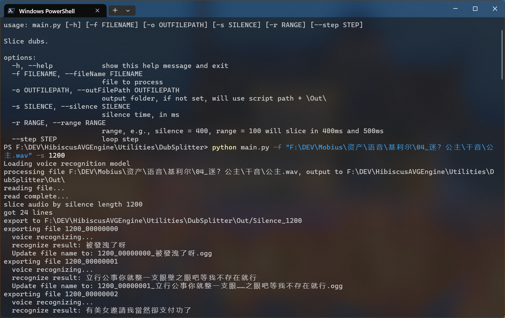

# DubSplitter

an easy tool to split dubs based on given silence

| Command           | type   | Info                                                                          |
|-------------------|--------|-------------------------------------------------------------------------------|
| -f, --fileName    | option | file to process                                                               |
| -o, --outFilePath | option | output folder, if not set, will use `script path + \Out\`                     |
| -s, --silence     | option | silence time, in ms                                                           |
| -r, --range       | option | range, e.g., silence = `400`, range = `100` will slice in `400`ms and `500`ms |
| --step            | option | loop step                                                                     |
