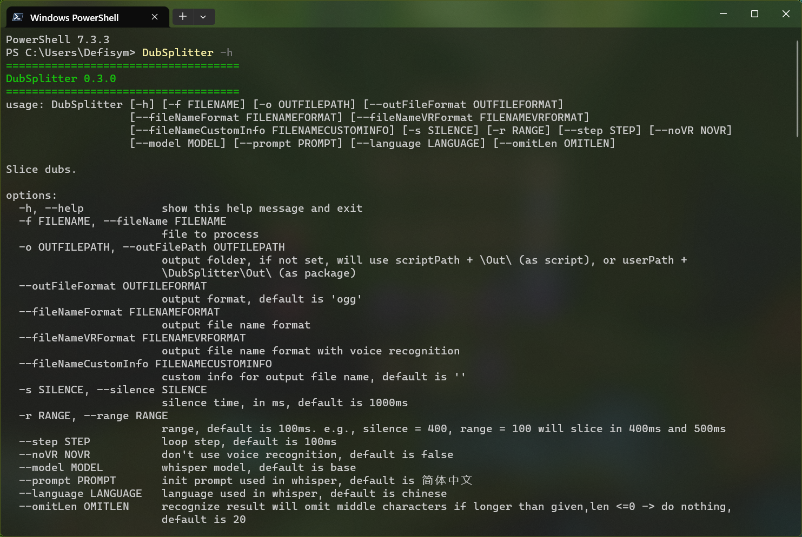

# DubSplitter

an easy tool to split dubs based on given silence

| Command           | type   | Info                                                                                              |
|-------------------|--------|---------------------------------------------------------------------------------------------------|
| -f, --fileName    | option | file to process                                                                                   |
| -o, --outFilePath | option | output folder, if not set, will use `script path + \Out\`                                         |
| -s, --silence     | option | silence time, in ms, default is `1000`ms                                                          |
| -r, --range       | option | range, default is `100`ms. e.g., silence = `400`, range = `100` will slice in `400`ms and `500`ms |
| --step            | option | loop step, default is `100`ms                                                                     |
| --noVR            | option | don't use voice recognition, default is false                                                     |
| --step            | option | whisper model, default is base                                                                    |
| --step            | option | language used in whisper, default is chinese                                                      |
